[](https://github.com/statnet)

<br>
<br>
<center> <h3>Comparing the Real-World Performance of Exponential-family Random Graph Models and Latent Order Logistic Models</h3></center>
<center> <h1>Reproducibility Code and data</h1></center>
<center> <h3>by</h3></center>
<center> <h3>Duncan A. Clark and Mark S. Handcock</h3></center>

This site contain code and software to reproduce example analyses from the paper 
<it>Comparing the Real-World Performance of Exponential family Random Graph Models and Latent Order Logistic Models</it> by Duncan A. Clark and  Mark
S. Handcock, 2021, to appear in XXX. The authirs are in the Department of Statistics at UCLA.

### Installation 

First, install the version of the ergm package used to produce the paper.
This requires the `statnet.common_4.2.0.tar.gz`, `network_1.15.tar.gz` and `ergm_3.9.4.tar.gz`
source code included here.
Then install the included LOLOG extension package `LologExtension_1.0.tar.gz` from source.

### Processing the raw publicly available network

Run the script to process the `.gexf` file for the network,
and adds covariates from the covariates from the covariate.csv file
additional objects are created for the purpose of modelling edge attributes.


```r
source("processing.R")
```

This produces the `processed_data.RData` data set.
 
### Case study: German Schoolboys network

First load some necessary packages:


```r
library("ergm")
library("lolog")
```


```r
# extended LOLOG package included as tar.gz for the fitting of cyclic triples
library("LologExtension")
```
Load the German Schoolboys network data in its processed form: 


```r
load("processed_data.RData")
```

Load the Utility Functions for fitting and GOF procedure 


```r
source("utility_functions.R")
```

0) Start with dyad independent model to see if this fits adequately:


```r
ergm_fit_1_0 <- ergm_fit(net, terms = c("edges", "nodeicov('handicapped')", "nodeocov('handicapped')",
    "nodeicov('sweetgiver')", "nodeocov('sweetgiver')", "nodeicov('rank')", "nodeocov('rank')",
    "nodeicov('repeater')", "nodeocov('repeater')"), gofit_terms = c("edges", "degree(0:25)",
    "esp(0:15)"), gofit_name = "ergm_1_0")
#> Warning: `set_attrs()` is deprecated as of rlang 0.3.0
#> This warning is displayed once per session.
#> Starting maximum pseudolikelihood estimation (MPLE):
#> Evaluating the predictor and response matrix.
#> Maximizing the pseudolikelihood.
#> Finished MPLE.
#> Stopping at the initial estimate.
#> Evaluating log-likelihood at the estimate.
```

See that fit isn't very good:


```r
plot(ergm_fit_1_0$gofit)
```

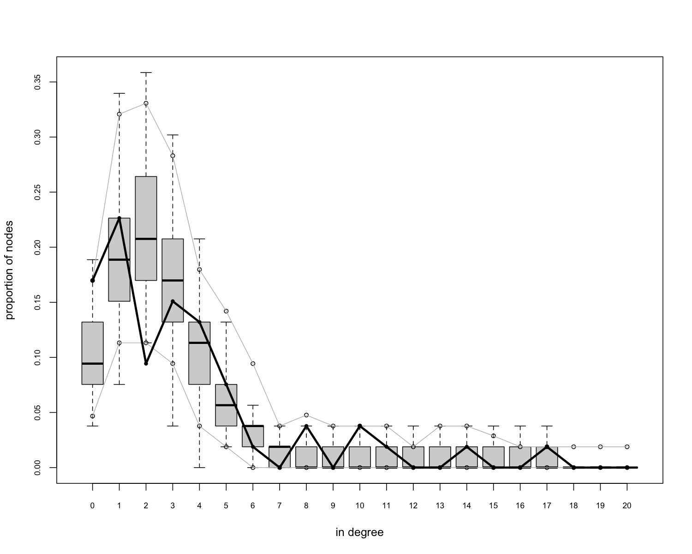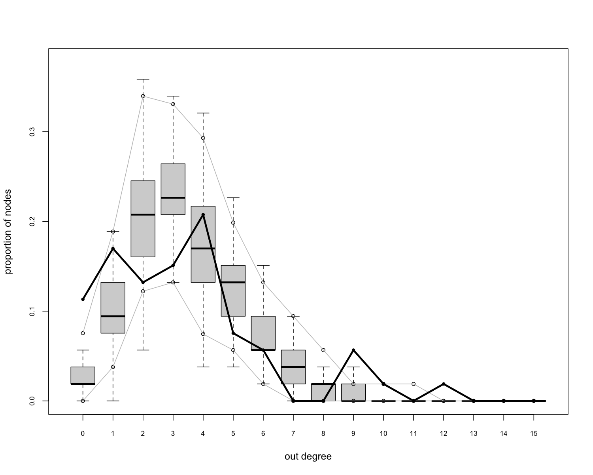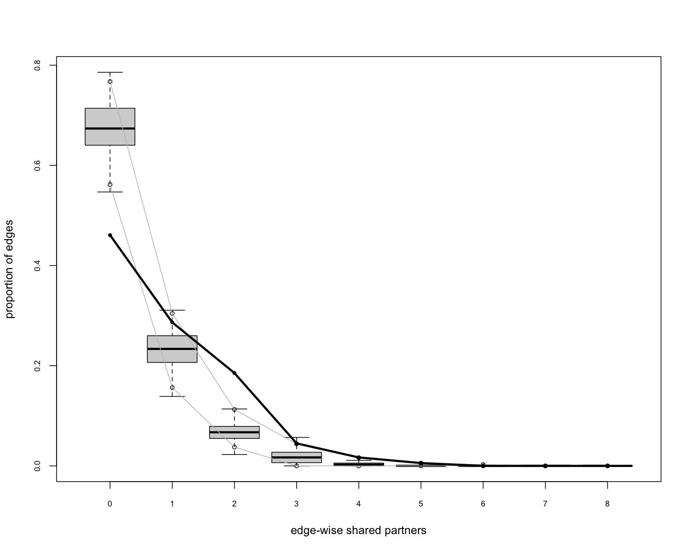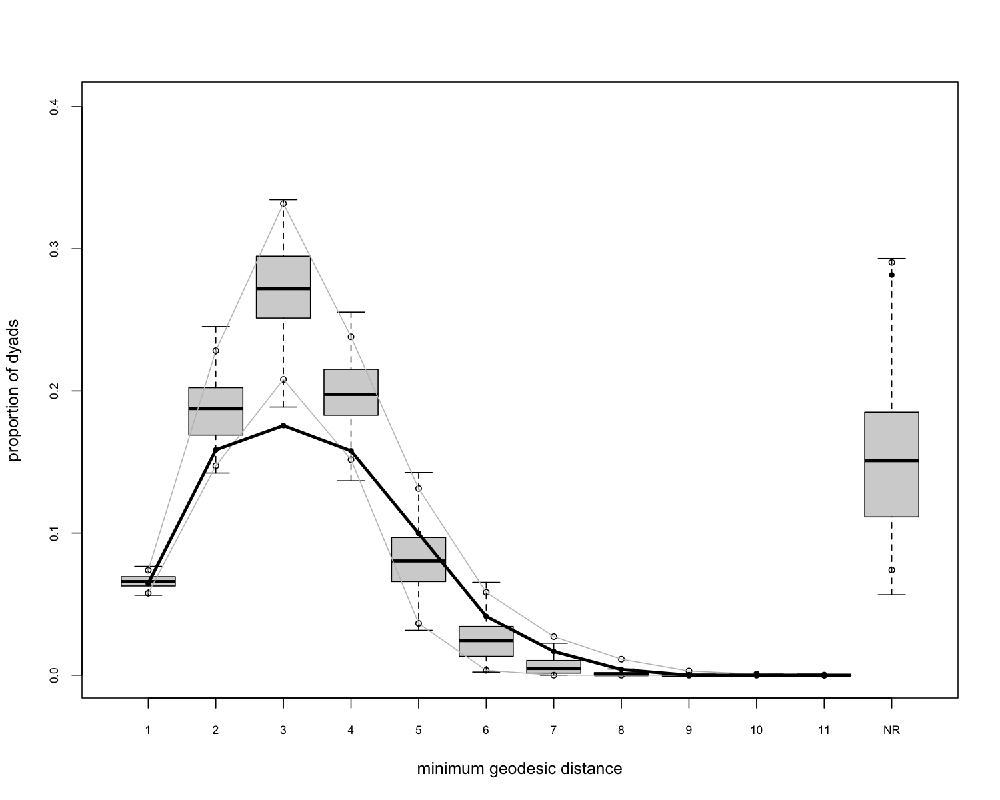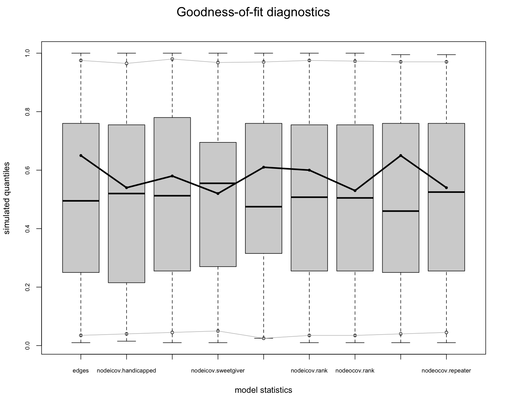
Seems that rank and repeater are the main covariate to have an effect
Possible sweetgiver also has an effect but since there is only one sweetgiver in 
the network the parameter MLE has a high s.d. and is not significant.

Does not fit well
Bad fit on degree and esp 

1) Model 1 in paper

Fit as in paper to replicate table 1 Markov model:


```r
ergm_fit_1_1 <- ergm_fit(net, terms = c("edges", "nodeicov('repeater_or_sweets')",
    "nodeicov('handicapped')", "nodeicov('rank')", "nodeocov('rank')", "absdiff('rank')",
    "gwesp()", "mutual", "cycle(3)", "m2star"), gofit_terms = c("edges", "degree(0:25)",
    "esp(0:15)"), gofit_name = "ergm_1_1")
#> Starting maximum pseudolikelihood estimation (MPLE):
#> Evaluating the predictor and response matrix.
#> Maximizing the pseudolikelihood.
#> Finished MPLE.
#> Starting Monte Carlo maximum likelihood estimation (MCMLE):
#> Iteration 1 of at most 20:
#> Optimizing with step length 0.565170203094615.
#> The log-likelihood improved by 2.602.
#> Iteration 2 of at most 20:
#> Optimizing with step length 1.
#> The log-likelihood improved by 2.03.
#> Step length converged once. Increasing MCMC sample size.
#> Iteration 3 of at most 20:
#> Optimizing with step length 1.
#> The log-likelihood improved by 0.1724.
#> Step length converged twice. Stopping.
#> Finished MCMLE.
#> Evaluating log-likelihood at the estimate. Using 20 bridges: 1 2 3 4 5 6 7 8 9 10 11 12 13 14 15 16 17 18 19 20 .
#> This model was fit using MCMC.  To examine model diagnostics and check for degeneracy, use the mcmc.diagnostics() function.
```

Comment on fit :
same as model in paper - managed to match!

Much improved fit on esp and min distance,slight improvement on in and out degree fit.

2) Model 2 in paper

Fit as in paper with uprank statistic to match results

```r
ergm_fit_1_2 <- ergm_fit(net,
                         terms = c("edges",
                                   "nodeicov('repeater_or_sweets')",
                                   "nodeicov('handicapped')",
                                   "nodeicov('rank')",
                                   #"nodeocov('rank')",
                                   "edgecov(edges_adj_uprank)",
                                   "absdiff('rank')",
                                   "gwesp()",
                                   "mutual",
                                   "cycle(3)",
                                   "m2star"),
                         gofit_terms = c("edges","degree(0:25)","esp(0:15)"),
                         gofit_name = "ergm_1_2")
#> Starting maximum pseudolikelihood estimation (MPLE):
#> Evaluating the predictor and response matrix.
#> Maximizing the pseudolikelihood.
#> Finished MPLE.
#> Starting Monte Carlo maximum likelihood estimation (MCMLE):
#> Iteration 1 of at most 20:
#> Optimizing with step length 0.569837097788369.
#> The log-likelihood improved by 2.579.
#> Iteration 2 of at most 20:
#> Optimizing with step length 1.
#> The log-likelihood improved by 2.085.
#> Step length converged once. Increasing MCMC sample size.
#> Iteration 3 of at most 20:
#> Optimizing with step length 1.
#> The log-likelihood improved by 0.1177.
#> Step length converged twice. Stopping.
#> Finished MCMLE.
#> Evaluating log-likelihood at the estimate. Using 20 bridges: 1 2 3 4 5 6 7 8 9 10 11 12 13 14 15 16 17 18 19 20 .
#> This model was fit using MCMC.  To examine model diagnostics and check for degeneracy, use the mcmc.diagnostics() function.
```

Similar to fit of model 1

3) Model 3 in paper

```r
ergm_fit_1_3 <- ergm_fit(net, terms = c("edges", "nodeicov('repeater_or_sweets')",
    "nodeicov('handicapped')", "nodeicov('rank')", "nodeocov('rank')", "edgecov(edges_adj_uprank)",
    "absdiff('rank')", "gwesp()", "mutual", "cycle(3)", "m2star"), gofit_terms = c("edges",
    "degree(0:25)", "esp(0:15)"), gofit_name = "ergm_1_3")
#> Starting maximum pseudolikelihood estimation (MPLE):
#> Evaluating the predictor and response matrix.
#> Maximizing the pseudolikelihood.
#> Finished MPLE.
#> Starting Monte Carlo maximum likelihood estimation (MCMLE):
#> Iteration 1 of at most 20:
#> Optimizing with step length 0.575403330224318.
#> The log-likelihood improved by 2.734.
#> Iteration 2 of at most 20:
#> Optimizing with step length 1.
#> The log-likelihood improved by 1.897.
#> Step length converged once. Increasing MCMC sample size.
#> Iteration 3 of at most 20:
#> Optimizing with step length 1.
#> The log-likelihood improved by 0.1495.
#> Step length converged twice. Stopping.
#> Finished MCMLE.
#> Evaluating log-likelihood at the estimate. Using 20 bridges: 1 2 3 4 5 6 7 8 9 10 11 12 13 14 15 16 17 18 19 20 .
#> This model was fit using MCMC.  To examine model diagnostics and check for degeneracy, use the mcmc.diagnostics() function.
```

Similar to fit of model 1

4) Include popularity terms this time

We suspect this might make some of the other covariate estimates not significant:

```r
ergm_fit_1_4 <- ergm_fit(net, terms = c("edges", "nodeicov('repeater_or_sweets')",
    "nodeicov('handicapped')", "nodeicov('rank')", "nodeocov('rank')", "edgecov(edges_adj_uprank)",
    "absdiff('rank')", "gwesp()", "gwidegree(fixed = FALSE)", "gwodegree(fixed = FALSE)",
    "mutual", "cycle(3)", "m2star"), gofit_terms = c("edges", "degree(0:25)", "esp(0:15)"),
    gofit_name = "ergm_1_4")
#> Starting maximum pseudolikelihood estimation (MPLE):
#> Evaluating the predictor and response matrix.
#> Maximizing the pseudolikelihood.
#> Finished MPLE.
#> Starting Monte Carlo maximum likelihood estimation (MCMLE):
#> Iteration 1 of at most 20:
#> Optimizing with step length 0.547086884589356.
#> The log-likelihood improved by 2.425.
#> Iteration 2 of at most 20:
#> Optimizing with step length 0.987969052530656.
#> The log-likelihood improved by 3.215.
#> Iteration 3 of at most 20:
#> Optimizing with step length 1.
#> The log-likelihood improved by 1.265.
#> Step length converged once. Increasing MCMC sample size.
#> Iteration 4 of at most 20:
#> Optimizing with step length 1.
#> The log-likelihood improved by 0.1099.
#> Step length converged twice. Stopping.
#> Finished MCMLE.
#> Evaluating log-likelihood at the estimate. Using 20 bridges: 1 2 3 4 5 6 7 8 9 10 11 12 13 14 15 16 17 18 19 20 .
#> This model was fit using MCMC.  To examine model diagnostics and check for degeneracy, use the mcmc.diagnostics() function.
```

ESP and minimum distance fit similar to model 1, slight improvement on in and out degree fit
It may suggest some popularity process not captured by model 1

5) Check to see if triangle and star model is degenerative:

```r
ergm_5 <- function(net, MCMC.samplesize, seed = 1) {
    tmp <- ergm(net ~ nodeicov("rank") + nodeicov("repeater_or_sweets") + nodeicov("handicapped") +
        nodeocov("rank") + edgecov(edges_adj_uprank) + absdiff("rank") + ttriple +
        mutual + cycle(3) + m2star + istar(c(2, 3, 4)) + ostar(c(2, 3, 4)) + edges,
        estimate = "MLE", control = control.ergm(seed = seed, MCMC.samplesize = MCMC.samplesize))
    return(tmp)
}

```

```r
ergm_1_5 <- ergm_5(net, 2^10, seed = 2)
summary(ergm_1_5)
gof_plot(ergm_1_5)
```
This did not converge - ergm degenerate

6) Model 2 in paper but with g weighted degrees instead of triangles

```r
ergm_fit_1_6 <- ergm_fit(net,
                         terms = c("edges",
                                   "nodeicov('repeater_or_sweets')",
                                   "nodeicov('handicapped')",
                                   "nodeicov('rank')",
                                   "nodeocov('rank')",
                                   "edgecov(edges_adj_uprank)",
                                   "absdiff('rank')",
                                   #"gwesp()",
                                   "gwidegree(fixed = FALSE)",
                                   "gwodegree(fixed = FALSE)",
                                   "mutual",
                                   "cycle(3)",
                                   "m2star"),
                         gofit_terms = c("edges","degree(0:25)","esp(0:15)"),
                         gofit_name = "ergm_1_6")
#> Starting maximum pseudolikelihood estimation (MPLE):
#> Evaluating the predictor and response matrix.
#> Maximizing the pseudolikelihood.
#> Finished MPLE.
#> Starting Monte Carlo maximum likelihood estimation (MCMLE):
#> Iteration 1 of at most 20:
#> Optimizing with step length 0.56411870896703.
#> The log-likelihood improved by 3.371.
#> Iteration 2 of at most 20:
#> Optimizing with step length 0.918626531179298.
#> The log-likelihood improved by 3.151.
#> Iteration 3 of at most 20:
#> Optimizing with step length 0.138348168867373.
#> The log-likelihood improved by 3.732.
#> Iteration 4 of at most 20:
#> Optimizing with step length 0.0568478184225685.
#> The log-likelihood improved by 1.926.
#> Iteration 5 of at most 20:
#> Optimizing with step length 0.00514462557892657.
#> The log-likelihood improved by 3.064.
#> Iteration 6 of at most 20:
#> Optimizing with step length 0.004462698811399.
#> The log-likelihood improved by 2.344.
#> Iteration 7 of at most 20:
#> Optimizing with step length 0.00222738866724505.
#> The log-likelihood improved by 1.263.
#> Iteration 8 of at most 20:
#> Optimizing with step length 0.00369036066387189.
#> The log-likelihood improved by 2.103.
#> Iteration 9 of at most 20:
#> Optimizing with step length 0.00666835619052665.
#> The log-likelihood improved by 2.092.
#> Iteration 10 of at most 20:
#> Optimizing with step length 0.0343883445967552.
#> The log-likelihood improved by 0.683.
#> Iteration 11 of at most 20:
#> Optimizing with step length 0.00402558357697527.
#> The log-likelihood improved by 9.042.
#> Iteration 12 of at most 20:
#> Optimizing with step length 0.
#> The log-likelihood improved by < 0.0001.
#> Iteration 13 of at most 20:
```

Key is to check whether this model captures the ESP distribution, since if it does
the ESP distribution may not be due to transitive closure.

Captures degree distribution arguably better than models with gwesp term.
ESP distribution fits somewhat, though issues with esp 0 and 2, so perhaps does not account for these well

### LOLOG Fitting 

0) Fit initial LOLOG model with dyad independence

```r
lolog_fit_1_0 <- lolog_fit(net, terms = c("edges", "nodeCov('handicapped_in','in')",
    "nodeCov('handicapped_out','out')", "nodeCov('sweetgiver_in','in')", "nodeCov('sweetgiver_out','out')",
    "nodeCov('rank_in','in')", "nodeCov('rank_out','out')", "nodeCov('repeater_in','in')",
    "nodeCov('repeater_out','out')"), gofit_terms = c("edges", "degree(0:25)", "esp(0:15)"),
    gofit_name = "lolog_1_0")
#> Initializing Using Variational Fit
#> 
#>  Model is dyad independent. Replications are redundant. Setting nReplicates <- 1L.
#> Model is dyad independent. Returning maximum likelihood estimate.
#> Warning in if (length(model) <= 1 & is.na(model)) {: the condition has length >
#> 1 and only the first element will be used
#> Note: Cannot create line plot with only one statistic. Falling back to boxplot
```

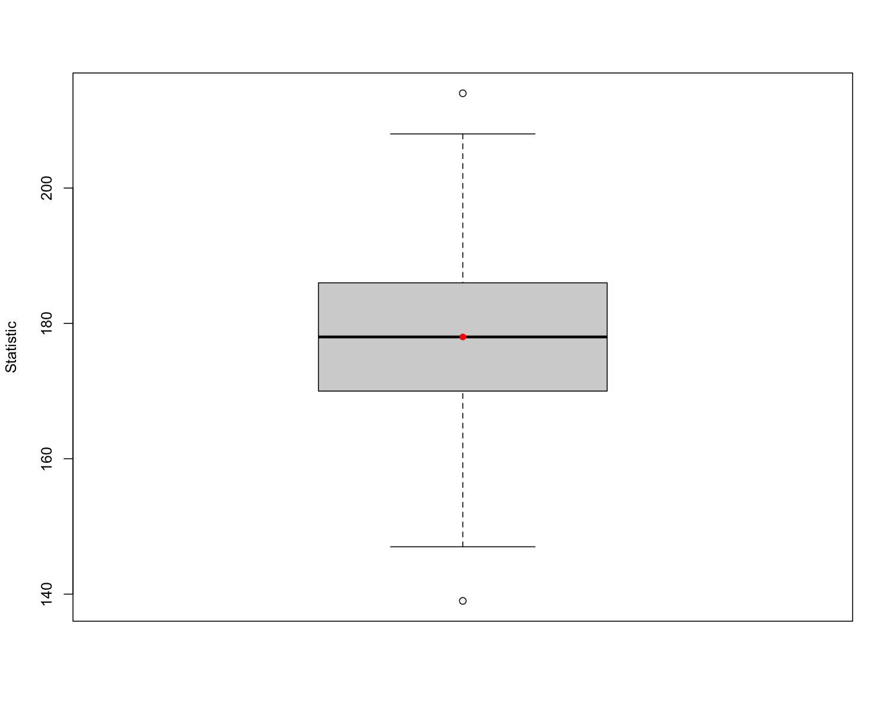

It is the same as dyad independent ergm - fit poor as expected!

1) Add parameters in paper model 1

```r
lolog_fit_1_1 <- lolog_fit(net,
                            terms = c("edges",
                                      "nodeCov('repeater_or_sweets_in','in')",
                                      "nodeCov('handicapped_in','in')",
                                      "nodeCov('rank_in','in')",
                                      "nodeCov('rank_out','out')",
                                      "edgeCov(edges_adj_rankdiff,'rankdiff')",
                                      #"edgeCov(edges_adj_uprank,'uprank')",
                                      "gwesp(0.5)",
                                      "mutual",
                                      "cTriple",
                                      "twoPath"),
                            gofit_terms = c("edges","degree(0:25)","esp(0:15)"),
                            gofit_name = "lolog_1_1")
```

Comments: This did not converge

Replace gwesp term with triangles 

```r
lolog_fit_1_1 <- lolog_fit(net,
                           terms = c("edges",
                                     "nodeCov('repeater_or_sweets_in','in')",
                                     "nodeCov('handicapped_in','in')",
                                     "nodeCov('rank_in','in')",
                                     "nodeCov('rank_out','out')",
                                     "edgeCov(edges_adj_rankdiff,'rankdiff')",
                                     #"edgeCov(edges_adj_uprank,'uprank')",
                                     #"gwesp(0.5)",
                                     "triangles",
                                     "mutual",
                                     "cTriple",
                                     "twoPath"),
                           gofit_terms = c("edges","degree(0:15,'out')","degree(0:15,'in')","esp(0:15)"),
                           gofit_name = "lolog_1_1")
#> Initializing Using Variational Fit
#> Initial Theta:
#>  -3.464497 1.612034 -0.4931803 0.01981202 -0.008631194 -0.007908257 0.3529026 2.083288 -0.6330716 0.008294728 
#> 
#> 
#> Iteration 1 
#> Drawing 1000 Monte Carlo Samples:
#> ================================================================================
#> 
#> Objective:  14.78364 
#> Hotelling's T2 p-value:  < 1e-05 
#> 
#> 
#> Iteration 2 
#> Drawing 1000 Monte Carlo Samples:
#> ================================================================================
#> 
#> Objective:  7.54673 
#> Hotelling's T2 p-value:  < 1e-05 
#> 
#> 
#> Iteration 3 
#> Drawing 1000 Monte Carlo Samples:
#> ================================================================================
#> 
#> Objective:  4.061582 
#> Hotelling's T2 p-value:  < 1e-05 
#> 
#> 
#> Iteration 4 
#> Drawing 1000 Monte Carlo Samples:
#> ================================================================================
#> 
#> Objective:  2.302068 
#> Hotelling's T2 p-value:  < 1e-05 
#> 
#> 
#> Iteration 5 
#> Drawing 1000 Monte Carlo Samples:
#> ================================================================================
#> 
#> Objective:  1.05724 
#> Hotelling's T2 p-value:  < 1e-05 
#> 
#> 
#> Iteration 6 
#> Drawing 1000 Monte Carlo Samples:
#> ================================================================================
#> 
#> Objective:  0.4143678 
#> Hotelling's T2 p-value:  < 1e-05 
#> 
#> 
#> Iteration 7 
#> Drawing 1000 Monte Carlo Samples:
#> ================================================================================
#> 
#> Objective:  0.1961294 
#> Hotelling's T2 p-value:  < 1e-05 
#> 
#> 
#> Iteration 8 
#> Drawing 1000 Monte Carlo Samples:
#> ================================================================================
#> 
#> Objective:  0.05089737 
#> Hotelling's T2 p-value:  < 1e-05 
#> 
#> 
#> Iteration 9 
#> Drawing 1000 Monte Carlo Samples:
#> ================================================================================
#> 
#> Objective:  0.02399654 
#> Hotelling's T2 p-value:  0.0076096 
#> 
#> 
#> Iteration 10 
#> Drawing 1000 Monte Carlo Samples:
#> ================================================================================
#> 
#> Objective:  0.01142279 
#> Hotelling's T2 p-value:  0.32554
#> Warning in if (length(model) <= 1 & is.na(model)) {: the condition has length >
#> 1 and only the first element will be used
#> Note: Cannot create line plot with only one statistic. Falling back to boxplot
```

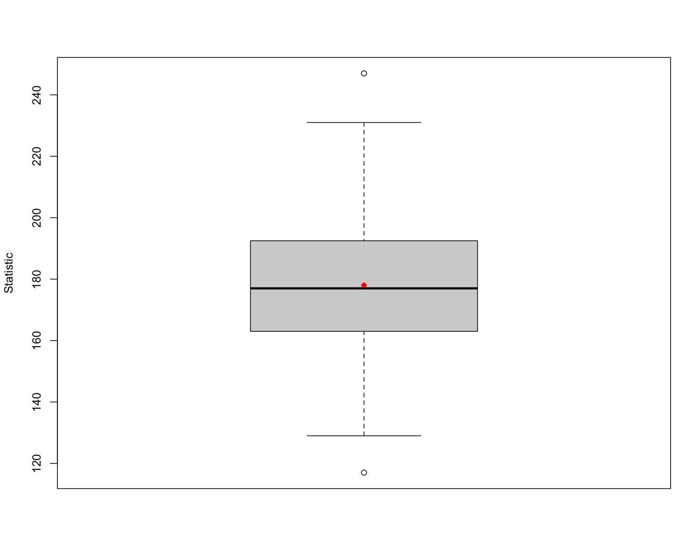

2) Add terms in paper model 2

```r
lolog_fit_1_2 <- lolog_fit(net,
                            terms = c("edges",
                                      "nodeCov('repeater_or_sweets_in','in')",
                                      "nodeCov('handicapped_in','in')",
                                      #"nodeCov('rank_in','in')",
                                      "nodeCov('rank_out','out')",
                                      "edgeCov(edges_adj_rankdiff,'rankdiff')",
                                      "edgeCov(edges_adj_uprank,'uprank')",
                                      "gwesp(0.5)",
                                      "mutual",
                                      "cTriple",
                                      "twoPath"),
                            gofit_terms = c("edges","degree(0:25)","esp(0:15)"),
                            gofit_name = "lolog_1_2")
```

Comment: This did not converge

Replace gwesp term with triangles 

```r
lolog_fit_1_2 <- lolog_fit(net,
                           terms = c("edges",
                                     "nodeCov('repeater_or_sweets_in','in')",
                                     "nodeCov('handicapped_in','in')",
                                     #"nodeCov('rank_in','in')",
                                     "nodeCov('rank_out','out')",
                                     "edgeCov(edges_adj_rankdiff,'rankdiff')",
                                     "edgeCov(edges_adj_uprank,'uprank')",
                                     #"gwesp(0.5)",
                                     "triangles",
                                     "mutual",
                                     "cTriple",
                                     "twoPath"),
                           gofit_terms = c("edges","degree(0:15,'out')","degree(0:15,'in')","esp(0:15)"),
                           gofit_name = "lolog_1_2")
#> Initializing Using Variational Fit
#> Initial Theta:
#>  -3.744139 1.611858 -0.5138638 0.007368004 -0.004766451 0.7568222 0.3486366 2.152196 -0.6164088 -0.006085682 
#> 
#> 
#> Iteration 1 
#> Drawing 1000 Monte Carlo Samples:
#> ================================================================================
#> 
#> Objective:  19.66419 
#> Hotelling's T2 p-value:  < 1e-05 
#> 
#> 
#> Iteration 2 
#> Drawing 1000 Monte Carlo Samples:
#> ================================================================================
#> 
#> Objective:  9.2791 
#> Hotelling's T2 p-value:  < 1e-05 
#> 
#> 
#> Iteration 3 
#> Drawing 1000 Monte Carlo Samples:
#> ================================================================================
#> 
#> Objective:  4.531837 
#> Hotelling's T2 p-value:  < 1e-05 
#> 
#> 
#> Iteration 4 
#> Drawing 1000 Monte Carlo Samples:
#> ================================================================================
#> 
#> Objective:  2.744157 
#> Hotelling's T2 p-value:  < 1e-05 
#> 
#> 
#> Iteration 5 
#> Drawing 1000 Monte Carlo Samples:
#> ================================================================================
#> 
#> Objective:  1.16296 
#> Hotelling's T2 p-value:  < 1e-05 
#> 
#> 
#> Iteration 6 
#> Drawing 1000 Monte Carlo Samples:
#> ================================================================================
#> 
#> Objective:  0.6037796 
#> Hotelling's T2 p-value:  < 1e-05 
#> 
#> 
#> Iteration 7 
#> Drawing 1000 Monte Carlo Samples:
#> ================================================================================
#> 
#> Objective:  0.2391942 
#> Hotelling's T2 p-value:  < 1e-05 
#> 
#> 
#> Iteration 8 
#> Drawing 1000 Monte Carlo Samples:
#> ================================================================================
#> 
#> Objective:  0.04600974 
#> Hotelling's T2 p-value:  < 1e-05 
#> 
#> 
#> Iteration 9 
#> Drawing 1000 Monte Carlo Samples:
#> ================================================================================
#> 
#> Objective:  0.03692388 
#> Hotelling's T2 p-value:  5.8335e-05 
#> 
#> 
#> Iteration 10 
#> Drawing 1000 Monte Carlo Samples:
#> ================================================================================
#> 
#> Objective:  0.01354789 
#> Hotelling's T2 p-value:  0.19463
#> Warning in if (length(model) <= 1 & is.na(model)) {: the condition has length >
#> 1 and only the first element will be used
#> Note: Cannot create line plot with only one statistic. Falling back to boxplot
```

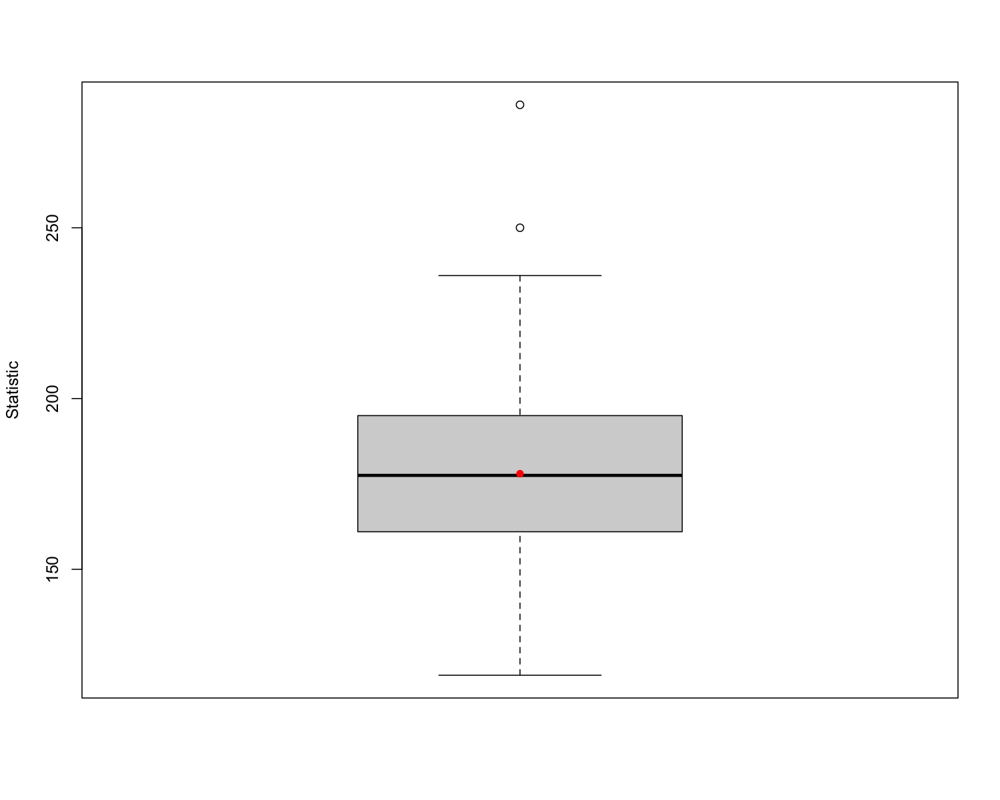

3)Add terms in paper model 3

```r
lolog_fit_1_3 <- lolog_fit(net, terms = c("edges", "nodeCov('repeater_or_sweets_in','in')",
    "nodeCov('handicapped_in','in')", "nodeCov('rank_in','in')", "nodeCov('rank_out','out')",
    "edgeCov(edges_adj_rankdiff,'rankdiff')", "edgeCov(edges_adj_uprank,'uprank')",
    "gwesp(0.5)", "mutual", "cTriple", "twoPath"), gofit_terms = c("edges", "degree(0:25)",
    "esp(0:15)"), gofit_name = "lolog_1_3")
```

Replace gwesp term with triangles 

```r
lolog_fit_1_3 <- lolog_fit(net,
                           terms = c("edges",
                                     "nodeCov('repeater_or_sweets_in','in')",
                                     "nodeCov('handicapped_in','in')",
                                     "nodeCov('rank_in','in')",
                                     "nodeCov('rank_out','out')",
                                     "edgeCov(edges_adj_rankdiff,'rankdiff')",
                                     "edgeCov(edges_adj_uprank,'uprank')",
                                     #"gwesp(0.5)",
                                     "triangles",
                                     "mutual",
                                     "cTriple",
                                     "twoPath"),
                           gofit_terms = c("edges","degree(0:15,'out')","degree(0:15,'in')","esp(0:15)"),
                           gofit_name = "lolog_1_3")
#> Initializing Using Variational Fit
#> Initial Theta:
#>  -3.807728 1.626018 -0.5761257 0.007308392 0.004019129 -0.00531629 0.5882317 0.3603192 2.25869 -0.6746248 0.006991181 
#> 
#> 
#> Iteration 1 
#> Drawing 1000 Monte Carlo Samples:
#> ================================================================================
#> 
#> Objective:  11.34067 
#> Hotelling's T2 p-value:  < 1e-05 
#> 
#> 
#> Iteration 2 
#> Drawing 1000 Monte Carlo Samples:
#> ================================================================================
#> 
#> Objective:  6.995858 
#> Hotelling's T2 p-value:  < 1e-05 
#> 
#> 
#> Iteration 3 
#> Drawing 1000 Monte Carlo Samples:
#> ================================================================================
#> 
#> Objective:  3.782293 
#> Hotelling's T2 p-value:  < 1e-05 
#> 
#> 
#> Iteration 4 
#> Drawing 1000 Monte Carlo Samples:
#> ================================================================================
#> 
#> Objective:  1.356747 
#> Hotelling's T2 p-value:  < 1e-05 
#> 
#> 
#> Iteration 5 
#> Drawing 1000 Monte Carlo Samples:
#> ================================================================================
#> 
#> Objective:  0.791375 
#> Hotelling's T2 p-value:  < 1e-05 
#> 
#> 
#> Iteration 6 
#> Drawing 1000 Monte Carlo Samples:
#> ================================================================================
#> 
#> Objective:  0.3989226 
#> Hotelling's T2 p-value:  < 1e-05 
#> 
#> 
#> Iteration 7 
#> Drawing 1000 Monte Carlo Samples:
#> ================================================================================
#> 
#> Objective:  0.2230733 
#> Hotelling's T2 p-value:  < 1e-05 
#> 
#> 
#> Iteration 8 
#> Drawing 1000 Monte Carlo Samples:
#> ================================================================================
#> 
#> Objective:  0.04396532 
#> Hotelling's T2 p-value:  < 1e-05 
#> 
#> 
#> Iteration 9 
#> Drawing 1000 Monte Carlo Samples:
#> ================================================================================
#> 
#> Objective:  0.03108156 
#> Hotelling's T2 p-value:  0.0010692 
#> 
#> 
#> Iteration 10 
#> Drawing 1000 Monte Carlo Samples:
#> ================================================================================
#> 
#> Objective:  0.02977035 
#> Hotelling's T2 p-value:  0.0017216 
#> 
#> 
#> Iteration 11 
#> Drawing 1000 Monte Carlo Samples:
#> ================================================================================
#> 
#> Objective:  0.008395744 
#> Hotelling's T2 p-value:  0.67748
#> Warning in if (length(model) <= 1 & is.na(model)) {: the condition has length >
#> 1 and only the first element will be used
#> Note: Cannot create line plot with only one statistic. Falling back to boxplot
```

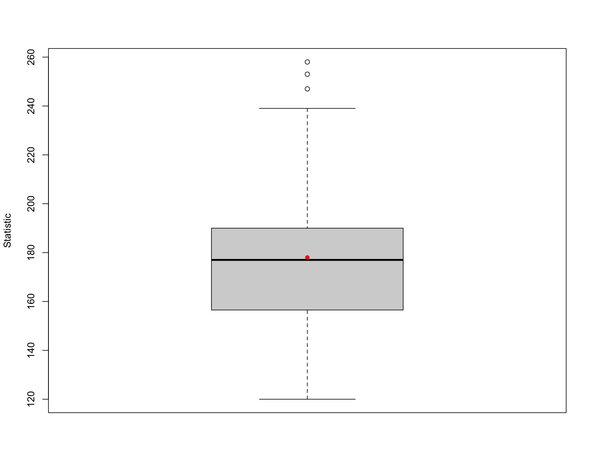

4) Lolog fitting procedure

Keep all covariate terms in model

Fit just with  triangles and mutual

```r
lolog_fit_1_4 <- lolog_fit(net, terms = c("edges", "nodeCov('repeater_or_sweets_in','in')",
    "nodeCov('handicapped_in','in')", "nodeCov('rank_in','in')", "nodeCov('rank_out','out')",
    "edgeCov(edges_adj_rankdiff,'rankdiff')", "edgeCov(edges_adj_uprank,'uprank')",
    "triangles", "mutual"), gofit_terms = c("edges", "degree(0:15,'out')", "degree(0:15,'in')",
    "esp(0:15)"), gofit_name = "lolog_1_4")
#> Initializing Using Variational Fit
#> Initial Theta:
#>  -3.805657 1.751817 -0.4961005 0.008400934 0.002070263 -0.004868958 0.5701763 0.2581171 2.177159 
#> 
#> 
#> Iteration 1 
#> Drawing 1000 Monte Carlo Samples:
#> ================================================================================
#> 
#> Objective:  5.03156 
#> Hotelling's T2 p-value:  < 1e-05 
#> 
#> 
#> Iteration 2 
#> Drawing 1000 Monte Carlo Samples:
#> ================================================================================
#> 
#> Objective:  1.579866 
#> Hotelling's T2 p-value:  < 1e-05 
#> 
#> 
#> Iteration 3 
#> Drawing 1000 Monte Carlo Samples:
#> ================================================================================
#> 
#> Objective:  1.47415 
#> Hotelling's T2 p-value:  < 1e-05 
#> 
#> 
#> Iteration 4 
#> Drawing 1000 Monte Carlo Samples:
#> ================================================================================
#> 
#> Objective:  0.4580345 
#> Hotelling's T2 p-value:  < 1e-05 
#> 
#> 
#> Iteration 5 
#> Drawing 1000 Monte Carlo Samples:
#> ================================================================================
#> 
#> Objective:  0.3886872 
#> Hotelling's T2 p-value:  < 1e-05 
#> 
#> 
#> Iteration 6 
#> Drawing 1000 Monte Carlo Samples:
#> ================================================================================
#> 
#> Objective:  0.07289753 
#> Hotelling's T2 p-value:  < 1e-05 
#> 
#> 
#> Iteration 7 
#> Drawing 1000 Monte Carlo Samples:
#> ================================================================================
#> 
#> Objective:  0.04749556 
#> Hotelling's T2 p-value:  < 1e-05 
#> 
#> 
#> Iteration 8 
#> Drawing 1000 Monte Carlo Samples:
#> ================================================================================
#> 
#> Objective:  0.03135406 
#> Hotelling's T2 p-value:  0.00025735 
#> 
#> 
#> Iteration 9 
#> Drawing 1000 Monte Carlo Samples:
#> ================================================================================
#> 
#> Objective:  0.03213293 
#> Hotelling's T2 p-value:  0.00018886 
#> 
#> 
#> Iteration 10 
#> Drawing 1000 Monte Carlo Samples:
#> ================================================================================
#> 
#> Objective:  0.01288773 
#> Hotelling's T2 p-value:  0.16775
#> Warning in if (length(model) <= 1 & is.na(model)) {: the condition has length >
#> 1 and only the first element will be used
#> Note: Cannot create line plot with only one statistic. Falling back to boxplot
```

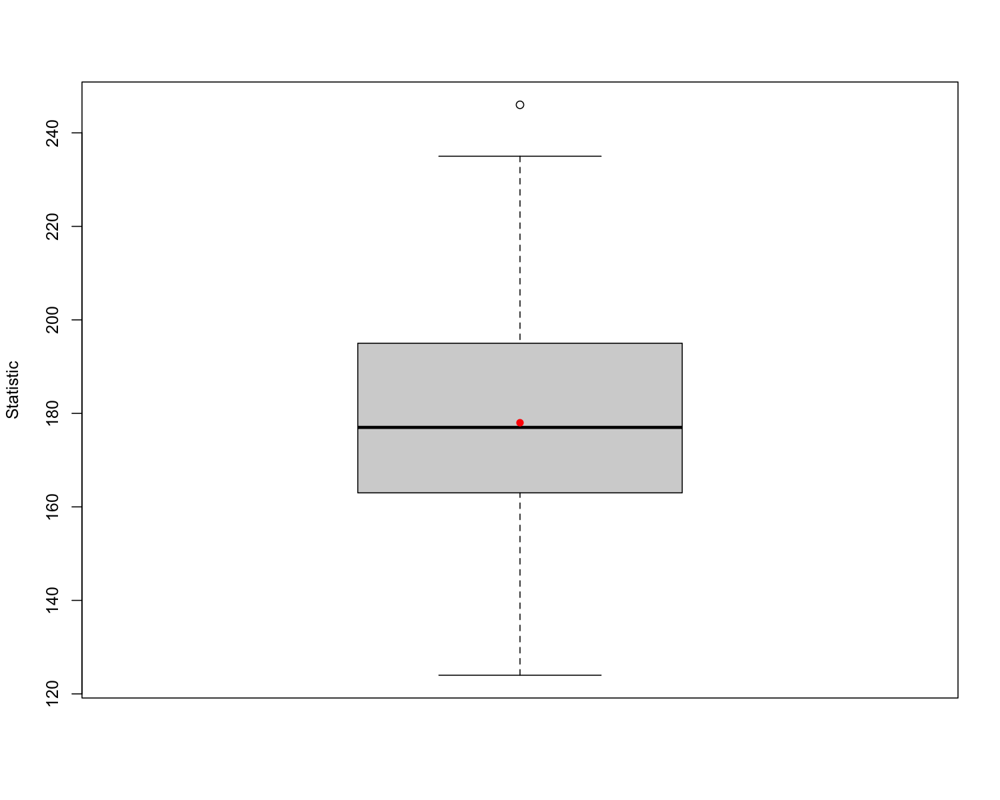

5) Fit with just 2,3 stars

```r
lolog_fit_1_5 <- lolog_fit(net, terms = c("edges", "nodeCov('repeater_or_sweets_in','in')",
    "nodeCov('handicapped_in','in')", "nodeCov('rank_in','in')", "nodeCov('rank_out','out')",
    "edgeCov(edges_adj_rankdiff,'rankdiff')", "edgeCov(edges_adj_uprank,'uprank')",
    "star(c(2,3))", "mutual"), gofit_terms = c("edges", "degree(0:15,'out')", "degree(0:15,'in')",
    "esp(0:15)"), gofit_name = "lolog_1_5")
#> Initializing Using Variational Fit
#> Initial Theta:
#>  -3.833015 1.684133 -0.4682667 0.009235379 0.002743069 -0.006167194 0.5616227 0.1186779 -0.01698047 2.266631 
#> 
#> 
#> Iteration 1 
#> Drawing 1000 Monte Carlo Samples:
#> ================================================================================
#> 
#> Objective:  3.949933 
#> Hotelling's T2 p-value:  < 1e-05 
#> 
#> 
#> Iteration 2 
#> Drawing 1000 Monte Carlo Samples:
#> ================================================================================
#> 
#> Objective:  2.953896 
#> Hotelling's T2 p-value:  < 1e-05 
#> 
#> 
#> Iteration 3 
#> Drawing 1000 Monte Carlo Samples:
#> ================================================================================
#> 
#> Objective:  1.992685 
#> Hotelling's T2 p-value:  < 1e-05 
#> 
#> 
#> Iteration 4 
#> Drawing 1000 Monte Carlo Samples:
#> ================================================================================
#> 
#> Objective:  1.269896 
#> Hotelling's T2 p-value:  < 1e-05 
#> 
#> 
#> Iteration 5 
#> Drawing 1000 Monte Carlo Samples:
#> ================================================================================
#> 
#> Objective:  0.7116781 
#> Hotelling's T2 p-value:  < 1e-05 
#> 
#> 
#> Iteration 6 
#> Drawing 1000 Monte Carlo Samples:
#> ================================================================================
#> 
#> Objective:  0.3628414 
#> Hotelling's T2 p-value:  < 1e-05 
#> 
#> 
#> Iteration 7 
#> Drawing 1000 Monte Carlo Samples:
#> ================================================================================
#> 
#> Objective:  0.1456849 
#> Hotelling's T2 p-value:  < 1e-05 
#> 
#> 
#> Iteration 8 
#> Drawing 1000 Monte Carlo Samples:
#> ================================================================================
#> 
#> Objective:  0.05925028 
#> Hotelling's T2 p-value:  < 1e-05 
#> 
#> 
#> Iteration 9 
#> Drawing 1000 Monte Carlo Samples:
#> ================================================================================
#> 
#> Objective:  0.03073144 
#> Hotelling's T2 p-value:  0.00064973 
#> 
#> 
#> Iteration 10 
#> Drawing 1000 Monte Carlo Samples:
#> ================================================================================
#> 
#> Objective:  0.01154442 
#> Hotelling's T2 p-value:  0.3167
#> Warning in if (length(model) <= 1 & is.na(model)) {: the condition has length >
#> 1 and only the first element will be used
#> Note: Cannot create line plot with only one statistic. Falling back to boxplot
```

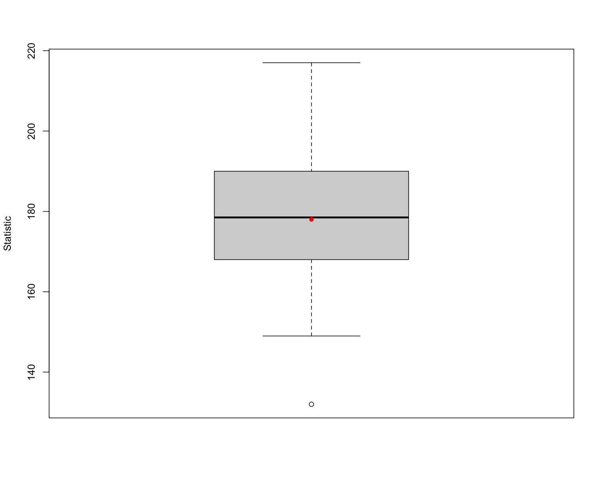

6) Fit with just 2,3,4,5 stars

```r
lolog_fit_1_6 <- lolog_fit(net, terms = c("edges", "nodeCov('repeater_or_sweets_in','in')",
    "nodeCov('handicapped_in','in')", "nodeCov('rank_in','in')", "nodeCov('rank_out','out')",
    "edgeCov(edges_adj_rankdiff,'rankdiff')", "edgeCov(edges_adj_uprank,'uprank')",
    "star(c(2,3,4,5))", "mutual"), gofit_terms = c("edges", "degree(0:15,'out')",
    "degree(0:15,'in')", "esp(0:15)"), gofit_name = "lolog_1_6")
#> Initializing Using Variational Fit
#> Initial Theta:
#>  -3.852444 1.693767 -0.4835581 0.008948224 0.001692078 -0.005883583 0.5434987 0.1953132 -0.05538419 0.01090502 -0.001573267 2.370794 
#> 
#> 
#> Iteration 1 
#> Drawing 1000 Monte Carlo Samples:
#> ================================================================================
#> 
#> Objective:  3.486777 
#> Hotelling's T2 p-value:  < 1e-05 
#> 
#> 
#> Iteration 2 
#> Drawing 1000 Monte Carlo Samples:
#> ================================================================================
#> 
#> Objective:  2.435412 
#> Hotelling's T2 p-value:  < 1e-05 
#> 
#> 
#> Iteration 3 
#> Drawing 1000 Monte Carlo Samples:
#> ================================================================================
#> 
#> Objective:  1.805212 
#> Hotelling's T2 p-value:  < 1e-05 
#> 
#> 
#> Iteration 4 
#> Drawing 1000 Monte Carlo Samples:
#> ================================================================================
#> 
#> Objective:  1.149213 
#> Hotelling's T2 p-value:  < 1e-05 
#> 
#> 
#> Iteration 5 
#> Drawing 1000 Monte Carlo Samples:
#> ================================================================================
#> 
#> Objective:  0.7100725 
#> Hotelling's T2 p-value:  < 1e-05 
#> 
#> 
#> Iteration 6 
#> Drawing 1000 Monte Carlo Samples:
#> ================================================================================
#> 
#> Objective:  0.3652472 
#> Hotelling's T2 p-value:  < 1e-05 
#> 
#> 
#> Iteration 7 
#> Drawing 1000 Monte Carlo Samples:
#> ================================================================================
#> 
#> Objective:  0.2027775 
#> Hotelling's T2 p-value:  < 1e-05 
#> 
#> 
#> Iteration 8 
#> Drawing 1000 Monte Carlo Samples:
#> ================================================================================
#> 
#> Objective:  0.0814275 
#> Hotelling's T2 p-value:  < 1e-05 
#> 
#> 
#> Iteration 9 
#> Drawing 1000 Monte Carlo Samples:
#> ================================================================================
#> 
#> Objective:  0.02716202 
#> Hotelling's T2 p-value:  0.0073226 
#> 
#> 
#> Iteration 10 
#> Drawing 1000 Monte Carlo Samples:
#> ================================================================================
#> 
#> Objective:  0.01763831 
#> Hotelling's T2 p-value:  0.12712
#> Warning in if (length(model) <= 1 & is.na(model)) {: the condition has length >
#> 1 and only the first element will be used
#> Note: Cannot create line plot with only one statistic. Falling back to boxplot
```

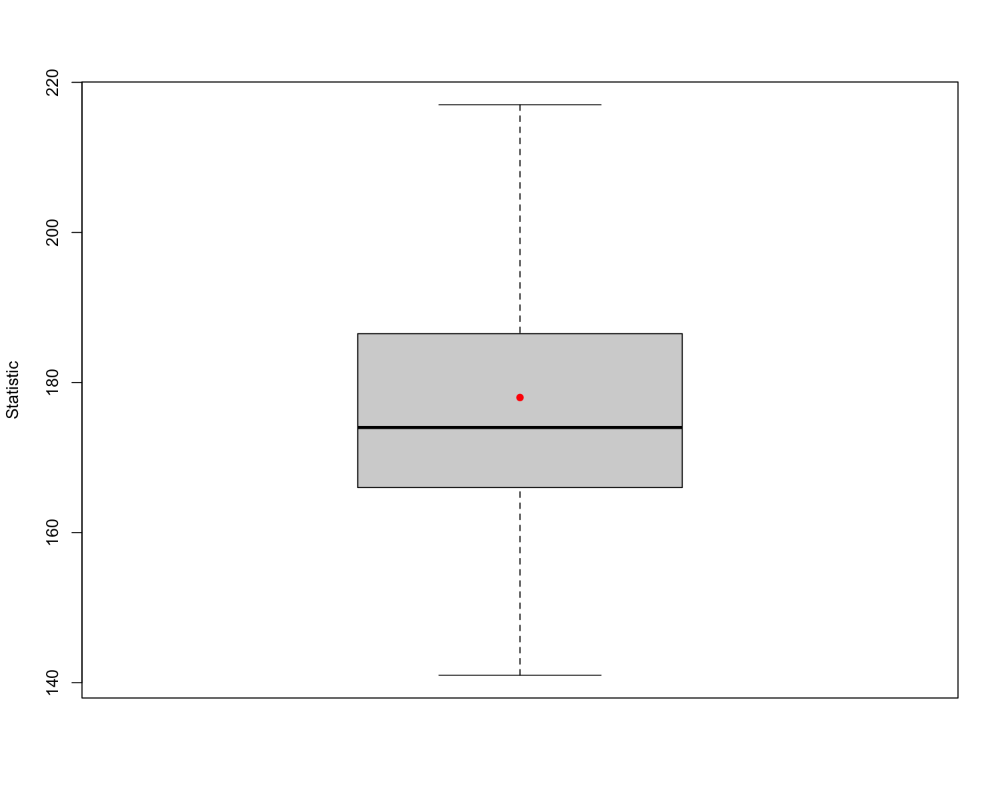


7) Fit with triangles and 2 and 3 stars

```r
lolog_fit_1_7 <- lolog_fit(net, terms = c("edges", "nodeCov('repeater_or_sweets_in','in')",
    "nodeCov('handicapped_in','in')", "nodeCov('rank_in','in')", "nodeCov('rank_out','out')",
    "edgeCov(edges_adj_rankdiff,'rankdiff')", "edgeCov(edges_adj_uprank,'uprank')",
    "triangles", "star(c(2,3))", "mutual"), gofit_terms = c("edges", "degree(0:15,'out')",
    "degree(0:15,'in')", "esp(0:15)"), gofit_name = "lolog_1_7")
#> Initializing Using Variational Fit
#> Initial Theta:
#>  -3.854197 1.822941 -0.476348 0.009278088 0.002052537 -0.006236754 0.5618083 0.2253107 0.07144753 -0.01772855 2.110137 
#> 
#> 
#> Iteration 1 
#> Drawing 1000 Monte Carlo Samples:
#> ================================================================================
#> 
#> Objective:  11.00556 
#> Hotelling's T2 p-value:  < 1e-05 
#> 
#> 
#> Iteration 2 
#> Drawing 1000 Monte Carlo Samples:
#> ================================================================================
#> 
#> Objective:  5.176819 
#> Hotelling's T2 p-value:  < 1e-05 
#> 
#> 
#> Iteration 3 
#> Drawing 1000 Monte Carlo Samples:
#> ================================================================================
#> 
#> Objective:  2.024089 
#> Hotelling's T2 p-value:  < 1e-05 
#> 
#> 
#> Iteration 4 
#> Drawing 1000 Monte Carlo Samples:
#> ================================================================================
#> 
#> Objective:  1.478076 
#> Hotelling's T2 p-value:  < 1e-05 
#> 
#> 
#> Iteration 5 
#> Drawing 1000 Monte Carlo Samples:
#> ================================================================================
#> 
#> Objective:  0.7081606 
#> Hotelling's T2 p-value:  < 1e-05 
#> 
#> 
#> Iteration 6 
#> Drawing 1000 Monte Carlo Samples:
#> ================================================================================
#> 
#> Objective:  0.3255376 
#> Hotelling's T2 p-value:  < 1e-05 
#> 
#> 
#> Iteration 7 
#> Drawing 1000 Monte Carlo Samples:
#> ================================================================================
#> 
#> Objective:  0.1517842 
#> Hotelling's T2 p-value:  < 1e-05 
#> 
#> 
#> Iteration 8 
#> Drawing 1000 Monte Carlo Samples:
#> ================================================================================
#> 
#> Objective:  0.03327449 
#> Hotelling's T2 p-value:  0.00047488 
#> 
#> 
#> Iteration 9 
#> Drawing 1000 Monte Carlo Samples:
#> ================================================================================
#> 
#> Objective:  0.01978604 
#> Hotelling's T2 p-value:  0.048363 
#> 
#> 
#> Iteration 10 
#> Drawing 1000 Monte Carlo Samples:
#> ================================================================================
#> 
#> Objective:  0.01076761 
#> Hotelling's T2 p-value:  0.46293
#> Warning in if (length(model) <= 1 & is.na(model)) {: the condition has length >
#> 1 and only the first element will be used
#> Note: Cannot create line plot with only one statistic. Falling back to boxplot
```

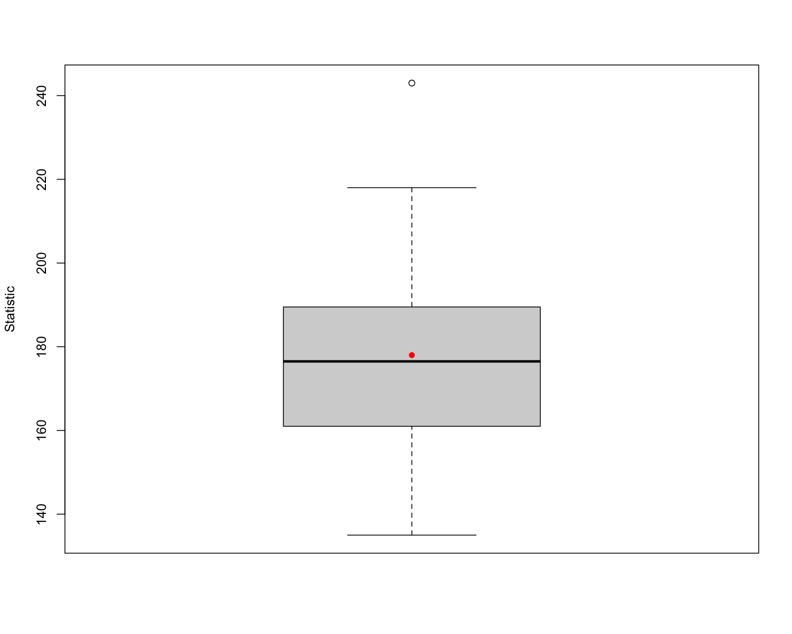

8) Fit with triangles and 2,3,4 and 5 stars

```r
lolog_fit_1_8 <- lolog_fit(net, terms = c("edges", "nodeCov('repeater_or_sweets_in','in')",
    "nodeCov('handicapped_in','in')", "nodeCov('rank_in','in')", "nodeCov('rank_out','out')",
    "edgeCov(edges_adj_rankdiff,'rankdiff')", "edgeCov(edges_adj_uprank,'uprank')",
    "triangles", "star(c(2,3,4,5))", "mutual"), gofit_terms = c("edges", "degree(0:15,'out')",
    "degree(0:15,'in')", "esp(0:15)"), gofit_name = "lolog_1_8")
#> Initializing Using Variational Fit
#> Initial Theta:
#>  -3.915161 1.813871 -0.5140858 0.008985575 0.002029495 -0.00597868 0.590947 0.2307117 0.1839133 -0.09826686 0.02535442 -0.003217416 2.158246 
#> 
#> 
#> Iteration 1 
#> Drawing 1000 Monte Carlo Samples:
#> ================================================================================
#> 
#> Objective:  10.14011 
#> Hotelling's T2 p-value:  < 1e-05 
#> 
#> 
#> Iteration 2 
#> Drawing 1000 Monte Carlo Samples:
#> ================================================================================
#> 
#> Objective:  5.108518 
#> Hotelling's T2 p-value:  < 1e-05 
#> 
#> 
#> Iteration 3 
#> Drawing 1000 Monte Carlo Samples:
#> ================================================================================
#> 
#> Objective:  2.756315 
#> Hotelling's T2 p-value:  < 1e-05 
#> 
#> 
#> Iteration 4 
#> Drawing 1000 Monte Carlo Samples:
#> ================================================================================
#> 
#> Objective:  1.637668 
#> Hotelling's T2 p-value:  < 1e-05 
#> 
#> 
#> Iteration 5 
#> Drawing 1000 Monte Carlo Samples:
#> ================================================================================
#> 
#> Objective:  0.8964432 
#> Hotelling's T2 p-value:  < 1e-05 
#> 
#> 
#> Iteration 6 
#> Drawing 1000 Monte Carlo Samples:
#> ================================================================================
#> 
#> Objective:  0.6120964 
#> Hotelling's T2 p-value:  < 1e-05 
#> 
#> 
#> Iteration 7 
#> Drawing 1000 Monte Carlo Samples:
#> ================================================================================
#> 
#> Objective:  0.1712663 
#> Hotelling's T2 p-value:  < 1e-05 
#> 
#> 
#> Iteration 8 
#> Drawing 1000 Monte Carlo Samples:
#> ================================================================================
#> 
#> Objective:  0.07330137 
#> Hotelling's T2 p-value:  < 1e-05 
#> 
#> 
#> Iteration 9 
#> Drawing 1000 Monte Carlo Samples:
#> ================================================================================
#> 
#> Objective:  0.04719557 
#> Hotelling's T2 p-value:  < 1e-05 
#> 
#> 
#> Iteration 10 
#> Drawing 1000 Monte Carlo Samples:
#> ================================================================================
#> 
#> Objective:  0.03236165 
#> Hotelling's T2 p-value:  0.0021228 
#> 
#> 
#> Iteration 11 
#> Drawing 1000 Monte Carlo Samples:
#> ================================================================================
#> 
#> Objective:  0.01522385 
#> Hotelling's T2 p-value:  0.29359
#> Warning in if (length(model) <= 1 & is.na(model)) {: the condition has length >
#> 1 and only the first element will be used
#> Note: Cannot create line plot with only one statistic. Falling back to boxplot
```

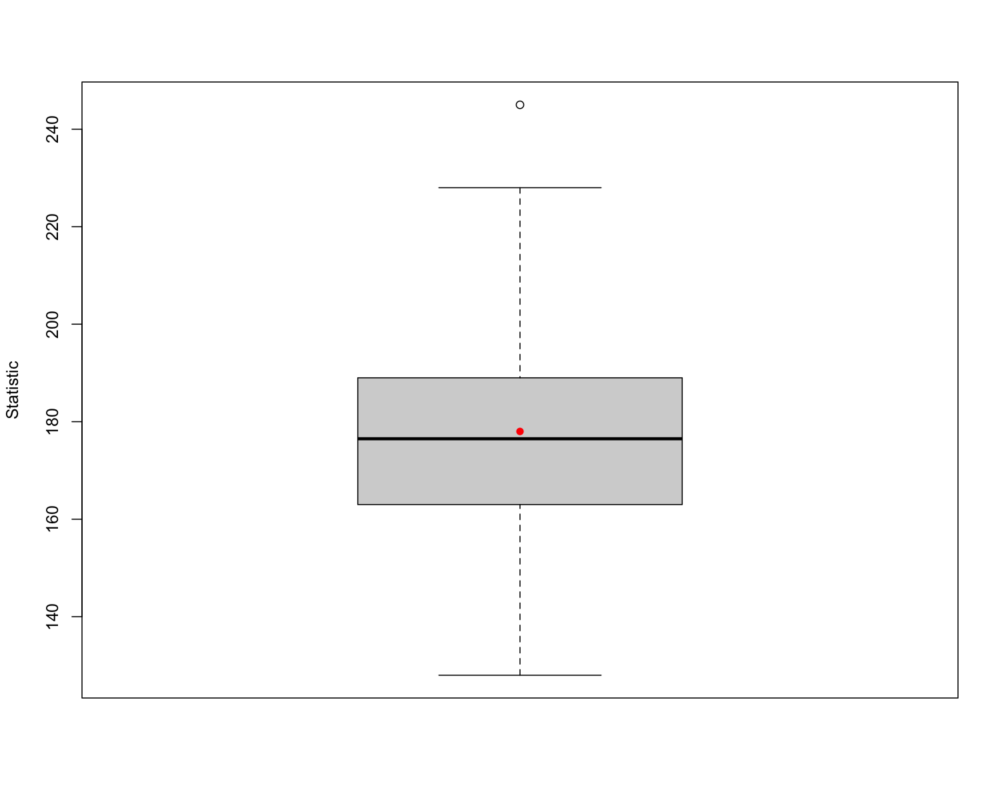

9) Fit with triangles, 2,3 stars and cTriples

```r
lolog_fit_1_9 <- lolog_fit(net, terms = c("edges", "nodeCov('repeater_or_sweets_in','in')",
    "nodeCov('handicapped_in','in')", "nodeCov('rank_in','in')", "nodeCov('rank_out','out')",
    "edgeCov(edges_adj_rankdiff,'rankdiff')", "edgeCov(edges_adj_uprank,'uprank')",
    "triangles", "star(c(2,3))", "cTriple", "mutual"), gofit_terms = c("edges", "degree(0:15,'out')",
    "degree(0:15,'in')", "esp(0:15)"), gofit_name = "lolog_1_9")
#> Initializing Using Variational Fit
#> Initial Theta:
#>  -3.880757 1.659385 -0.4485162 0.007951911 0.003681714 -0.005480813 0.566795 0.3379233 0.08863526 -0.01938226 -0.6160172 2.154782 
#> 
#> 
#> Iteration 1 
#> Drawing 1000 Monte Carlo Samples:
#> ================================================================================
#> 
#> Objective:  19.12974 
#> Hotelling's T2 p-value:  < 1e-05 
#> 
#> 
#> Iteration 2 
#> Drawing 1000 Monte Carlo Samples:
#> ================================================================================
#> 
#> Objective:  9.217885 
#> Hotelling's T2 p-value:  < 1e-05 
#> 
#> 
#> Iteration 3 
#> Drawing 1000 Monte Carlo Samples:
#> ================================================================================
#> 
#> Objective:  6.184461 
#> Hotelling's T2 p-value:  < 1e-05 
#> 
#> 
#> Iteration 4 
#> Drawing 1000 Monte Carlo Samples:
#> ================================================================================
#> 
#> Objective:  3.76867 
#> Hotelling's T2 p-value:  < 1e-05 
#> 
#> 
#> Iteration 5 
#> Drawing 1000 Monte Carlo Samples:
#> ================================================================================
#> 
#> Objective:  1.965795 
#> Hotelling's T2 p-value:  < 1e-05 
#> 
#> 
#> Iteration 6 
#> Drawing 1000 Monte Carlo Samples:
#> ================================================================================
#> 
#> Objective:  0.8450761 
#> Hotelling's T2 p-value:  < 1e-05 
#> 
#> 
#> Iteration 7 
#> Drawing 1000 Monte Carlo Samples:
#> ================================================================================
#> 
#> Objective:  0.3652156 
#> Hotelling's T2 p-value:  < 1e-05 
#> 
#> 
#> Iteration 8 
#> Drawing 1000 Monte Carlo Samples:
#> ================================================================================
#> 
#> Objective:  0.1145649 
#> Hotelling's T2 p-value:  < 1e-05 
#> 
#> 
#> Iteration 9 
#> Drawing 1000 Monte Carlo Samples:
#> ================================================================================
#> 
#> Objective:  0.04643934 
#> Hotelling's T2 p-value:  < 1e-05 
#> 
#> 
#> Iteration 10 
#> Drawing 1000 Monte Carlo Samples:
#> ================================================================================
#> 
#> Objective:  0.01763716 
#> Hotelling's T2 p-value:  0.12716
#> Warning in if (length(model) <= 1 & is.na(model)) {: the condition has length >
#> 1 and only the first element will be used
#> Note: Cannot create line plot with only one statistic. Falling back to boxplot
```

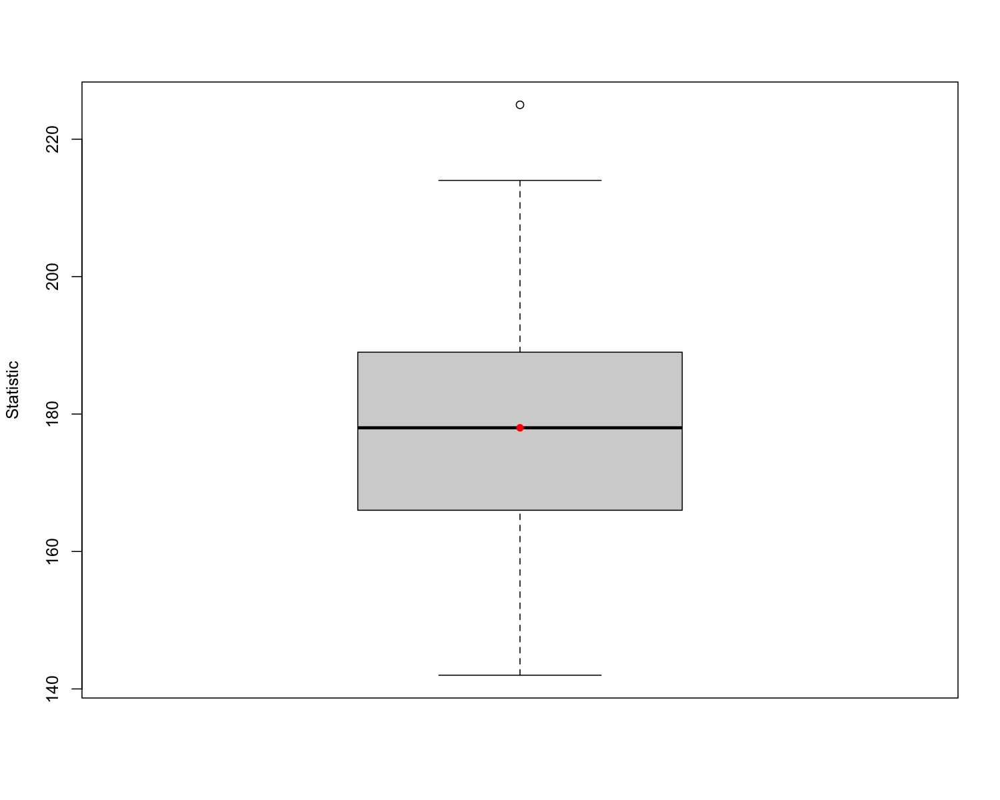

10) Fit with triangles, 2,3 stars and twoPaths

```r
lolog_fit_1_10 <- lolog_fit(net, terms = c("edges", "nodeCov('repeater_or_sweets_in','in')",
    "nodeCov('handicapped_in','in')", "nodeCov('rank_in','in')", "nodeCov('rank_out','out')",
    "edgeCov(edges_adj_rankdiff,'rankdiff')", "edgeCov(edges_adj_uprank,'uprank')",
    "triangles", "star(c(2,3))", "twoPaths", "mutual"), gofit_terms = c("edges",
    "degree(0:15,'out')", "degree(0:15,'in')", "esp(0:15)"), gofit_name = "lolog_1_10")
#> Initializing Using Variational Fit
```
11) Fit with triangles, 2,3 stars and twoPaths and cTriple

```r
lolog_fit_1_11 <- lolog_fit(net, terms = c("edges", "nodeCov('repeater_or_sweets_in','in')",
    "nodeCov('handicapped_in','in')", "nodeCov('rank_in','in')", "nodeCov('rank_out','out')",
    "edgeCov(edges_adj_rankdiff,'rankdiff')", "edgeCov(edges_adj_uprank,'uprank')",
    "triangles", "star(c(2,3))", "cTriple", "twoPaths", "mutual"), gofit_terms = c("edges",
    "degree(0:15,'out')", "degree(0:15,'in')", "esp(0:15)"), gofit_name = "lolog_1_11")
#> Initializing Using Variational Fit
```

Cannot have both triangles two paths

12) Fit with star(2,3), twoPaths, 

```r
lolog_fit_1_12 <- lolog_fit(net, terms = c("edges", "nodeCov('repeater_or_sweets_in','in')",
    "nodeCov('handicapped_in','in')", "nodeCov('rank_in','in')", "nodeCov('rank_out','out')",
    "edgeCov(edges_adj_rankdiff,'rankdiff')", "edgeCov(edges_adj_uprank,'uprank')",
    "star(c(2,3))", "twoPaths", "mutual"), gofit_terms = c("edges", "degree(0:15,'out')",
    "degree(0:15,'in')", "esp(0:15)"), gofit_name = "lolog_1_11")
#> Initializing Using Variational Fit
```

13) Fit with star(c(2,3)), and twoPaths and cTriple

```r
lolog_fit_1_13 <- lolog_fit(net, terms = c("edges", "nodeCov('repeater_or_sweets_in','in')",
    "nodeCov('handicapped_in','in')", "nodeCov('rank_in','in')", "nodeCov('rank_out','out')",
    "edgeCov(edges_adj_rankdiff,'rankdiff')", "edgeCov(edges_adj_uprank,'uprank')",
    "star(c(2,3))", "cTriple", "twoPaths", "mutual"), gofit_terms = c("edges", "degree(0:15,'out')",
    "degree(0:15,'in')", "esp(0:15)"), gofit_name = "lolog_1_13")
#> Initializing Using Variational Fit
```

14) Try to fit with transitive triples

```r
lolog_fit_1_14 <- lolog_fit(net,
                            terms = c("edges",
                                      "nodeCov('repeater_or_sweets_in','in')",
                                      "nodeCov('handicapped_in','in')",
                                      "nodeCov('rank_in','in')",
                                      "nodeCov('rank_out','out')",
                                      "edgeCov(edges_adj_rankdiff,'rankdiff')",
                                      "edgeCov(edges_adj_uprank,'uprank')",
                                      #"triangles",
                                      #"star(c(2,3))",
                                      #"cTriple",
                                      #"twoPaths",
                                      "tTriple",
                                      "mutual"),
                            gofit_terms = c("edges","degree(0:15,'out')","degree(0:15,'in')","esp(0:15)"),
                            gofit_name = "lolog_1_14")
#> Initializing Using Variational Fit
#> Initial Theta:
#>  -3.766442 1.639777 -0.4779553 0.008407957 0.002438856 -0.005850902 0.5631792 0.323105 2.181925 
#> 
#> 
#> Iteration 1 
#> Drawing 1000 Monte Carlo Samples:
#> ================================================================================
#> 
#> Objective:  7.634677 
#> Hotelling's T2 p-value:  < 1e-05 
#> 
#> 
#> Iteration 2 
#> Drawing 1000 Monte Carlo Samples:
#> ================================================================================
#> 
#> Objective:  3.935984 
#> Hotelling's T2 p-value:  < 1e-05 
#> 
#> 
#> Iteration 3 
#> Drawing 1000 Monte Carlo Samples:
#> ================================================================================
#> 
#> Objective:  2.501646 
#> Hotelling's T2 p-value:  < 1e-05 
#> 
#> 
#> Iteration 4 
#> Drawing 1000 Monte Carlo Samples:
#> ================================================================================
#> 
#> Objective:  1.322736 
#> Hotelling's T2 p-value:  < 1e-05 
#> 
#> 
#> Iteration 5 
#> Drawing 1000 Monte Carlo Samples:
#> ================================================================================
#> 
#> Objective:  0.3218897 
#> Hotelling's T2 p-value:  < 1e-05 
#> 
#> 
#> Iteration 6 
#> Drawing 1000 Monte Carlo Samples:
#> ================================================================================
#> 
#> Objective:  0.2227054 
#> Hotelling's T2 p-value:  < 1e-05 
#> 
#> 
#> Iteration 7 
#> Drawing 1000 Monte Carlo Samples:
#> ================================================================================
#> 
#> Objective:  0.06451715 
#> Hotelling's T2 p-value:  < 1e-05 
#> 
#> 
#> Iteration 8 
#> Drawing 1000 Monte Carlo Samples:
#> ================================================================================
#> 
#> Objective:  0.02232804 
#> Hotelling's T2 p-value:  0.0078955 
#> 
#> 
#> Iteration 9 
#> Drawing 1000 Monte Carlo Samples:
#> ================================================================================
#> 
#> Objective:  0.0317702 
#> Hotelling's T2 p-value:  0.00021818 
#> 
#> 
#> Iteration 10 
#> Drawing 1000 Monte Carlo Samples:
#> ================================================================================
#> 
#> Objective:  0.0181157 
#> Hotelling's T2 p-value:  0.033855 
#> 
#> 
#> Iteration 11 
#> Drawing 1000 Monte Carlo Samples:
#> ================================================================================
#> 
#> Objective:  0.02896999 
#> Hotelling's T2 p-value:  0.00065564 
#> 
#> 
#> Iteration 12 
#> Drawing 1000 Monte Carlo Samples:
#> ================================================================================
#> 
#> Objective:  0.004801547 
#> Hotelling's T2 p-value:  0.85125
#> Warning in if (length(model) <= 1 & is.na(model)) {: the condition has length >
#> 1 and only the first element will be used
#> Note: Cannot create line plot with only one statistic. Falling back to boxplot
```

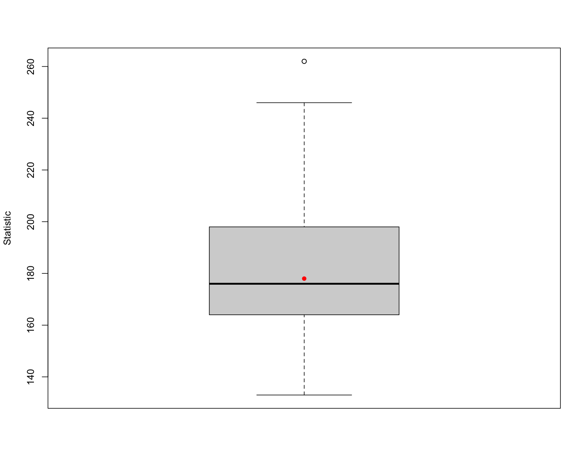

15) Try to fit with transitive triples

```r
lolog_fit_1_15 <- lolog_fit(net,
                            terms = c("edges",
                                      "nodeCov('repeater_or_sweets_in','in')",
                                      "nodeCov('handicapped_in','in')",
                                      "nodeCov('rank_in','in')",
                                      "nodeCov('rank_out','out')",
                                      "edgeCov(edges_adj_rankdiff,'rankdiff')",
                                      "edgeCov(edges_adj_uprank,'uprank')",
                                      #"triangles",
                                      "star(c(2,3))",
                                      #"cTriple",
                                      #"twoPaths",
                                      "tTriple",
                                      "mutual"),
                            gofit_terms = c("edges","degree(0:15,'out')","degree(0:15,'in')","esp(0:15)"),
                            gofit_name = "lolog_1_15")
#> Initializing Using Variational Fit
#> Initial Theta:
#>  -3.880437 1.601471 -0.5457578 0.00778844 0.003486737 -0.007152066 0.6278392 0.08661697 -0.01735774 0.3217116 2.163022 
#> 
#> 
#> Iteration 1 
#> Drawing 1000 Monte Carlo Samples:
#> ================================================================================
#> 
#> Objective:  12.16264 
#> Hotelling's T2 p-value:  < 1e-05 
#> 
#> 
#> Iteration 2 
#> Drawing 1000 Monte Carlo Samples:
#> ================================================================================
#> 
#> Objective:  6.497848 
#> Hotelling's T2 p-value:  < 1e-05 
#> 
#> 
#> Iteration 3 
#> Drawing 1000 Monte Carlo Samples:
#> ================================================================================
#> 
#> Objective:  2.964743 
#> Hotelling's T2 p-value:  < 1e-05 
#> 
#> 
#> Iteration 4 
#> Drawing 1000 Monte Carlo Samples:
#> ================================================================================
#> 
#> Objective:  1.997811 
#> Hotelling's T2 p-value:  < 1e-05 
#> 
#> 
#> Iteration 5 
#> Drawing 1000 Monte Carlo Samples:
#> ================================================================================
#> 
#> Objective:  1.147048 
#> Hotelling's T2 p-value:  < 1e-05 
#> 
#> 
#> Iteration 6 
#> Drawing 1000 Monte Carlo Samples:
#> ================================================================================
#> 
#> Objective:  0.6540057 
#> Hotelling's T2 p-value:  < 1e-05 
#> 
#> 
#> Iteration 7 
#> Drawing 1000 Monte Carlo Samples:
#> ================================================================================
#> 
#> Objective:  0.3133188 
#> Hotelling's T2 p-value:  < 1e-05 
#> 
#> 
#> Iteration 8 
#> Drawing 1000 Monte Carlo Samples:
#> ================================================================================
#> 
#> Objective:  0.1168307 
#> Hotelling's T2 p-value:  < 1e-05 
#> 
#> 
#> Iteration 9 
#> Drawing 1000 Monte Carlo Samples:
#> ================================================================================
#> 
#> Objective:  0.05930359 
#> Hotelling's T2 p-value:  < 1e-05 
#> 
#> 
#> Iteration 10 
#> Drawing 1000 Monte Carlo Samples:
#> ================================================================================
#> 
#> Objective:  0.01073156 
#> Hotelling's T2 p-value:  0.46602
#> Warning in if (length(model) <= 1 & is.na(model)) {: the condition has length >
#> 1 and only the first element will be used
#> Note: Cannot create line plot with only one statistic. Falling back to boxplot
```

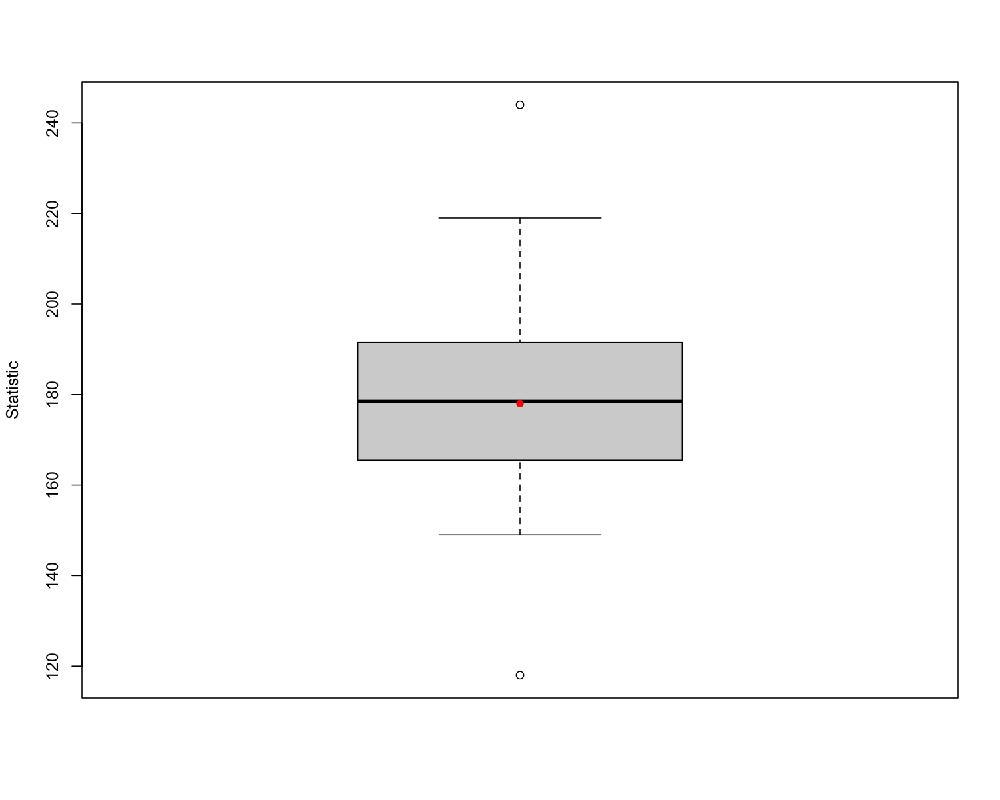

16) Try to fit with transitive triples

```r
lolog_fit_1_16 <- lolog_fit(net,
                            terms = c("edges",
                                      "nodeCov('repeater_or_sweets_in','in')",
                                      "nodeCov('handicapped_in','in')",
                                      "nodeCov('rank_in','in')",
                                      "nodeCov('rank_out','out')",
                                      "edgeCov(edges_adj_rankdiff,'rankdiff')",
                                      "edgeCov(edges_adj_uprank,'uprank')",
                                      #"triangles",
                                      "star(c(2,3))",
                                      "cTriple",
                                      #"twoPaths",
                                      "tTriple",
                                      "mutual"),
                            gofit_terms = c("edges","degree(0:15,'out')","degree(0:15,'in')","esp(0:15)"),
                            gofit_name = "lolog_1_16")
#> Initializing Using Variational Fit
#> Initial Theta:
#>  -3.884641 1.729795 -0.4922888 0.008871705 0.00329982 -0.006366957 0.5742316 0.06958335 -0.01777208 -0.2808416 0.3638999 2.286765 
#> 
#> 
#> Iteration 1 
#> Drawing 1000 Monte Carlo Samples:
#> ================================================================================
#> 
#> Objective:  14.22386 
#> Hotelling's T2 p-value:  < 1e-05 
#> 
#> 
#> Iteration 2 
#> Drawing 1000 Monte Carlo Samples:
#> ================================================================================
#> 
#> Objective:  10.15307 
#> Hotelling's T2 p-value:  < 1e-05 
#> 
#> 
#> Iteration 3 
#> Drawing 1000 Monte Carlo Samples:
#> ================================================================================
#> 
#> Objective:  5.142095 
#> Hotelling's T2 p-value:  < 1e-05 
#> 
#> 
#> Iteration 4 
#> Drawing 1000 Monte Carlo Samples:
#> ================================================================================
#> 
#> Objective:  2.663877 
#> Hotelling's T2 p-value:  < 1e-05 
#> 
#> 
#> Iteration 5 
#> Drawing 1000 Monte Carlo Samples:
#> ================================================================================
#> 
#> Objective:  1.192427 
#> Hotelling's T2 p-value:  < 1e-05 
#> 
#> 
#> Iteration 6 
#> Drawing 1000 Monte Carlo Samples:
#> ================================================================================
#> 
#> Objective:  0.5107343 
#> Hotelling's T2 p-value:  < 1e-05 
#> 
#> 
#> Iteration 7 
#> Drawing 1000 Monte Carlo Samples:
#> ================================================================================
#> 
#> Objective:  0.3840547 
#> Hotelling's T2 p-value:  < 1e-05 
#> 
#> 
#> Iteration 8 
#> Drawing 1000 Monte Carlo Samples:
#> ================================================================================
#> 
#> Objective:  0.117756 
#> Hotelling's T2 p-value:  < 1e-05 
#> 
#> 
#> Iteration 9 
#> Drawing 1000 Monte Carlo Samples:
#> ================================================================================
#> 
#> Objective:  0.01925088 
#> Hotelling's T2 p-value:  0.082651 
#> 
#> 
#> Iteration 10 
#> Drawing 1000 Monte Carlo Samples:
#> ================================================================================
#> 
#> Objective:  0.01788389 
#> Hotelling's T2 p-value:  0.11926
#> Warning in if (length(model) <= 1 & is.na(model)) {: the condition has length >
#> 1 and only the first element will be used
#> Note: Cannot create line plot with only one statistic. Falling back to boxplot
```

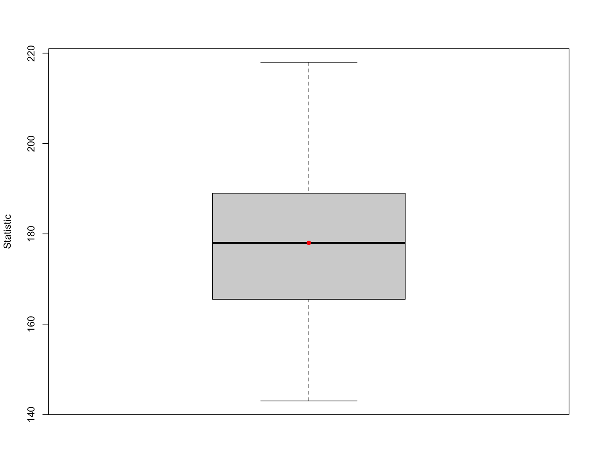

17) Try to fit with transitive triples

```r
lolog_fit_1_17 <- lolog_fit(net,
                            terms = c("edges",
                                      "nodeCov('repeater_or_sweets_in','in')",
                                      "nodeCov('handicapped_in','in')",
                                      "nodeCov('rank_in','in')",
                                      "nodeCov('rank_out','out')",
                                      "edgeCov(edges_adj_rankdiff,'rankdiff')",
                                      "edgeCov(edges_adj_uprank,'uprank')",
                                      "triangles",
                                      "star(c(2,3))",
                                      "cTriple",
                                      #"twoPaths",
                                      "tTriple",
                                      "mutual"),
                            gofit_terms = c("edges","degree(0:15,'out')","degree(0:15,'in')","esp(0:15)"),
                            gofit_name = "lolog_1_17")
#> Initializing Using Variational Fit
#> Initial Theta:
#>  -3.837394 1.740313 -0.5176708 0.007709233 0.004886012 -0.00578862 0.5829215 0.3571289 0.05141532 -0.01829913 -0.6211791 NA 2.174579 
#> 
#> 
#> Iteration 1 
#> Drawing 1000 Monte Carlo Samples:
#> ================================================================================
#> 
#> Error in solve.default(var(auxStats)) : 
#>   Lapack routine dgesv: system is exactly singular: U[1,1] = 0
#> Warning in lolog(formula, auxFormula = auxFormula, cl = cl, nsamp = nsamp, :
#> Singular statistic covariance matrix. Using diagnoal.
#> Objective:  Inf 
#> Hotelling's T2 p-value:  NA 
#> 
#> 
#> Iteration 2 
#> Drawing 1000 Monte Carlo Samples:
#> ================================================================================
#> 
#> Error in solve.default(var(auxStats)) : 
#>   Lapack routine dgesv: system is exactly singular: U[1,1] = 0
#> Warning in lolog(formula, auxFormula = auxFormula, cl = cl, nsamp = nsamp, :
#> Singular statistic covariance matrix. Using diagnoal.
#> Objective:  Inf
```

18) Fit with preferential attachment term, fitting with star(2,3) and triangle terms

```r
lolog_fit_1_18 <- lolog_fit(net,
                            terms = c("edges",
                                      "nodeCov('repeater_or_sweets_in','in')",
                                      "nodeCov('handicapped_in','in')",
                                      "nodeCov('rank_in','in')",
                                      "nodeCov('rank_out','out')",
                                      "edgeCov(edges_adj_rankdiff,'rankdiff')",
                                      "edgeCov(edges_adj_uprank,'uprank')",
                                      #"star(c(2,3))",
                                      #"cTriple",
                                      #"twoPaths",
                                      "mutual",
                                      "preferentialAttachment(1)"),
                            gofit_terms = c("edges","degree(0:15,'out')","degree(0:15,'in')","esp(0:15)"),
                            fit_terms = c("star(c(2,3))","triangles"),
                            gofit_name = "lolog_1_18")
#> Initializing Using Variational Fit
#> Initial Theta:
#>  -3.362413 1.80207 -0.5195743 0.01024988 0.001934173 -0.006217679 0.5754325 2.135689 0.07893848 
#> 
#> 
#> Iteration 1 
#> Drawing 1000 Monte Carlo Samples:
#> ================================================================================
#> 
#> Objective:  43.19479 
#> Hotelling's T2 p-value:  < 1e-05 
#> 
#> 
#> Iteration 2 
#> Drawing 1000 Monte Carlo Samples:
#> ================================================================================
#> 
#> Objective:  29.18595 
#> Hotelling's T2 p-value:  < 1e-05 
#> 
#> 
#> Iteration 3 
#> Drawing 1000 Monte Carlo Samples:
#> ================================================================================
#> 
#> Objective:  20.17424 
#> Hotelling's T2 p-value:  < 1e-05 
#> 
#> 
#> Iteration 4 
#> Drawing 1000 Monte Carlo Samples:
#> ================================================================================
#> 
#> Objective:  16.24196 
#> Hotelling's T2 p-value:  < 1e-05 
#> 
#> 
#> Iteration 5 
#> Drawing 1000 Monte Carlo Samples:
#> ================================================================================
#> 
#> Objective:  15.37098 
#> Hotelling's T2 p-value:  < 1e-05 
#> 
#> 
#> Iteration 6 
#> Drawing 1000 Monte Carlo Samples:
#> ================================================================================
#> 
#> Objective:  14.82187 
#> Hotelling's T2 p-value:  < 1e-05 
#> 
#> 
#> Iteration 7 
#> Drawing 1000 Monte Carlo Samples:
#> ================================================================================
#> 
#> Objective:  10.07344 
#> Hotelling's T2 p-value:  < 1e-05 
#> 
#> 
#> Iteration 8 
#> Drawing 1000 Monte Carlo Samples:
#> ================================================================================
#> 
#> Objective:  11.00358 
#> Hotelling's T2 p-value:  < 1e-05 
#> 
#> 
#> Iteration 9 
#> Drawing 1000 Monte Carlo Samples:
#> ================================================================================
#> 
#> Objective:  11.44788 
#> Hotelling's T2 p-value:  1.627e-05 
#> 
#> 
#> Iteration 10 
#> Drawing 1000 Monte Carlo Samples:
#> ================================================================================
#> 
#> Objective:  10.16445 
#> Hotelling's T2 p-value:  2.3448e-05 
#> 
#> 
#> Iteration 11 
#> Drawing 1000 Monte Carlo Samples:
#> ================================================================================
#> 
#> Objective:  9.772216 
#> Hotelling's T2 p-value:  < 1e-05 
#> 
#> 
#> Iteration 12 
#> Drawing 1000 Monte Carlo Samples:
#> ================================================================================
#> 
#> Objective:  10.87189 
#> Hotelling's T2 p-value:  < 1e-05 
#> 
#> 
#> Iteration 13 
#> Drawing 1000 Monte Carlo Samples:
#> ================================================================================
#> 
#> Objective:  10.57482 
#> Hotelling's T2 p-value:  2.3482e-05 
#> 
#> 
#> Iteration 14 
#> Drawing 1000 Monte Carlo Samples:
#> ================================================================================
#> 
#> Objective:  10.79077 
#> Hotelling's T2 p-value:  1.3285e-05 
#> 
#> 
#> Iteration 15 
#> Drawing 1000 Monte Carlo Samples:
#> ================================================================================
#> 
#> Objective:  10.00028 
#> Hotelling's T2 p-value:  0.00060155 
#> 
#> 
#> Iteration 16 
#> Drawing 1000 Monte Carlo Samples:
#> ================================================================================
#> 
#> Objective:  10.41133 
#> Hotelling's T2 p-value:  < 1e-05 
#> 
#> 
#> Iteration 17 
#> Drawing 1000 Monte Carlo Samples:
#> ================================================================================
#> 
#> Objective:  11.40959 
#> Hotelling's T2 p-value:  < 1e-05 
#> 
#> 
#> Iteration 18 
#> Drawing 1000 Monte Carlo Samples:
#> ================================================================================
#> 
#> Objective:  11.24871 
#> Hotelling's T2 p-value:  0.0021454 
#> 
#> 
#> Iteration 19 
#> Drawing 1000 Monte Carlo Samples:
#> ================================================================================
#> 
#> Objective:  11.65269 
#> Hotelling's T2 p-value:  < 1e-05 
#> 
#> 
#> Iteration 20 
#> Drawing 1000 Monte Carlo Samples:
#> ================================================================================
#> 
#> Objective:  10.94656 
#> Hotelling's T2 p-value:  < 1e-05 
#> 
#> 
#> Iteration 21 
#> Drawing 1000 Monte Carlo Samples:
#> ================================================================================
#> 
#> Objective:  11.30458 
#> Hotelling's T2 p-value:  0.015804 
#> 
#> 
#> Iteration 22 
#> Drawing 1000 Monte Carlo Samples:
#> ================================================================================
#> 
#> Objective:  9.672336 
#> Hotelling's T2 p-value:  0.070017 
#> 
#> 
#> Iteration 23 
#> Drawing 1000 Monte Carlo Samples:
#> ================================================================================
#> 
#> Objective:  11.24032 
#> Hotelling's T2 p-value:  0.080034 
#> 
#> 
#> Iteration 24 
#> Drawing 1000 Monte Carlo Samples:
#> ================================================================================
#> 
#> Objective:  9.114176 
#> Hotelling's T2 p-value:  < 1e-05 
#> 
#> 
#> Iteration 25 
#> Drawing 1000 Monte Carlo Samples:
#> ================================================================================
#> 
#> Objective:  10.24621 
#> Hotelling's T2 p-value:  < 1e-05 
#> 
#> 
#> Iteration 26 
#> Drawing 1000 Monte Carlo Samples:
#> ================================================================================
#> 
#> Objective:  11.41596 
#> Hotelling's T2 p-value:  < 1e-05 
#> 
#> 
#> Iteration 27 
#> Drawing 1000 Monte Carlo Samples:
#> ================================================================================
#> 
#> Objective:  10.91105 
#> Hotelling's T2 p-value:  0.00035318 
#> 
#> 
#> Iteration 28 
#> Drawing 1000 Monte Carlo Samples:
#> ================================================================================
#> 
#> Objective:  11.22046 
#> Hotelling's T2 p-value:  < 1e-05 
#> 
#> 
#> Iteration 29 
#> Drawing 1000 Monte Carlo Samples:
#> ================================================================================
#> 
#> Objective:  10.74821 
#> Hotelling's T2 p-value:  < 1e-05 
#> 
#> 
#> Iteration 30 
#> Drawing 1000 Monte Carlo Samples:
#> ================================================================================
#> 
#> Objective:  10.48177 
#> Hotelling's T2 p-value:  0.028416 
#> 
#> 
#> Iteration 31 
#> Drawing 1000 Monte Carlo Samples:
#> ================================================================================
#> 
#> Objective:  10.89718 
#> Hotelling's T2 p-value:  < 1e-05 
#> 
#> 
#> Iteration 32 
#> Drawing 1000 Monte Carlo Samples:
#> ================================================================================
#> 
#> Objective:  11.46726 
#> Hotelling's T2 p-value:  1.1317e-05 
#> 
#> 
#> Iteration 33 
#> Drawing 1000 Monte Carlo Samples:
#> ================================================================================
#> 
#> Objective:  9.851124 
#> Hotelling's T2 p-value:  < 1e-05 
#> 
#> 
#> Iteration 34 
#> Drawing 1000 Monte Carlo Samples:
#> ================================================================================
#> 
#> Objective:  11.40062 
#> Hotelling's T2 p-value:  < 1e-05 
#> 
#> 
#> Iteration 35 
#> Drawing 1000 Monte Carlo Samples:
#> ================================================================================
#> 
#> Objective:  11.66327 
#> Hotelling's T2 p-value:  < 1e-05 
#> 
#> 
#> Iteration 36 
#> Drawing 1000 Monte Carlo Samples:
#> ================================================================================
#> 
#> Objective:  10.02266 
#> Hotelling's T2 p-value:  < 1e-05 
#> 
#> 
#> Iteration 37 
#> Drawing 1000 Monte Carlo Samples:
#> ================================================================================
#> 
#> Objective:  12.06103 
#> Hotelling's T2 p-value:  < 1e-05 
#> 
#> 
#> Iteration 38 
#> Drawing 1000 Monte Carlo Samples:
#> ================================================================================
#> 
#> Objective:  10.49843 
#> Hotelling's T2 p-value:  < 1e-05 
#> 
#> 
#> Iteration 39 
#> Drawing 1000 Monte Carlo Samples:
#> ================================================================================
#> 
#> Objective:  12.07376 
#> Hotelling's T2 p-value:  < 1e-05 
#> 
#> 
#> Iteration 40 
#> Drawing 1000 Monte Carlo Samples:
#> ================================================================================
#> 
#> Objective:  9.90318 
#> Hotelling's T2 p-value:  < 1e-05 
#> 
#> 
#> Iteration 41 
#> Drawing 1000 Monte Carlo Samples:
#> ================================================================================
#> 
#> Objective:  10.12346 
#> Hotelling's T2 p-value:  0.00059305 
#> 
#> 
#> Iteration 42 
#> Drawing 1000 Monte Carlo Samples:
#> ================================================================================
#> 
#> Objective:  10.49353 
#> Hotelling's T2 p-value:  < 1e-05 
#> 
#> 
#> Iteration 43 
#> Drawing 1000 Monte Carlo Samples:
#> ================================================================================
#> 
#> Objective:  12.91416 
#> Hotelling's T2 p-value:  < 1e-05 
#> 
#> 
#> Iteration 44 
#> Drawing 1000 Monte Carlo Samples:
#> ================================================================================
#> 
#> Objective:  10.66126 
#> Hotelling's T2 p-value:  < 1e-05 
#> 
#> 
#> Iteration 45 
#> Drawing 1000 Monte Carlo Samples:
#> ================================================================================
#> 
#> Objective:  9.770094 
#> Hotelling's T2 p-value:  0.00023494 
#> 
#> 
#> Iteration 46 
#> Drawing 1000 Monte Carlo Samples:
#> ================================================================================
#> 
#> Objective:  10.22771 
#> Hotelling's T2 p-value:  < 1e-05 
#> 
#> 
#> Iteration 47 
#> Drawing 1000 Monte Carlo Samples:
#> ================================================================================
#> 
#> Objective:  9.775631 
#> Hotelling's T2 p-value:  < 1e-05 
#> 
#> 
#> Iteration 48 
#> Drawing 1000 Monte Carlo Samples:
#> ================================================================================
#> 
#> Objective:  9.981223 
#> Hotelling's T2 p-value:  < 1e-05 
#> 
#> 
#> Iteration 49 
#> Drawing 1000 Monte Carlo Samples:
#> ================================================================================
#> 
#> Objective:  10.98481 
#> Hotelling's T2 p-value:  < 1e-05 
#> 
#> 
#> Iteration 50 
#> Drawing 1000 Monte Carlo Samples:
#> ================================================================================
#> 
#> Objective:  10.33206 
#> Hotelling's T2 p-value:  0.00045724 
#> 
#> 
#> Iteration 51 
#> Drawing 1000 Monte Carlo Samples:
#> ================================================================================
#> 
#> Objective:  9.006129 
#> Hotelling's T2 p-value:  < 1e-05 
#> 
#> 
#> Iteration 52 
#> Drawing 1000 Monte Carlo Samples:
#> ================================================================================
#> 
#> Objective:  9.082082 
#> Hotelling's T2 p-value:  0.00069242 
#> 
#> 
#> Iteration 53 
#> Drawing 1000 Monte Carlo Samples:
#> ================================================================================
#> 
#> Objective:  10.33082 
#> Hotelling's T2 p-value:  < 1e-05 
#> 
#> 
#> Iteration 54 
#> Drawing 1000 Monte Carlo Samples:
#> ================================================================================
#> 
#> Objective:  10.74841 
#> Hotelling's T2 p-value:  < 1e-05 
#> 
#> 
#> Iteration 55 
#> Drawing 1000 Monte Carlo Samples:
#> ================================================================================
#> 
#> Objective:  10.26382 
#> Hotelling's T2 p-value:  < 1e-05 
#> 
#> 
#> Iteration 56 
#> Drawing 1000 Monte Carlo Samples:
#> ================================================================================
#> 
#> Objective:  12.02325 
#> Hotelling's T2 p-value:  0.0024229 
#> 
#> 
#> Iteration 57 
#> Drawing 1000 Monte Carlo Samples:
#> ================================================================================
#> 
#> Objective:  10.21121 
#> Hotelling's T2 p-value:  0.00018554 
#> 
#> 
#> Iteration 58 
#> Drawing 1000 Monte Carlo Samples:
#> ================================================================================
#> 
#> Objective:  11.22632 
#> Hotelling's T2 p-value:  0.084317 
#> 
#> 
#> Iteration 59 
#> Drawing 1000 Monte Carlo Samples:
#> ================================================================================
#> 
#> Objective:  11.34425 
#> Hotelling's T2 p-value:  < 1e-05 
#> 
#> 
#> Iteration 60 
#> Drawing 1000 Monte Carlo Samples:
#> ================================================================================
#> 
#> Objective:  11.73948 
#> Hotelling's T2 p-value:  < 1e-05 
#> 
#> 
#> Iteration 61 
#> Drawing 1000 Monte Carlo Samples:
#> ================================================================================
#> 
#> Objective:  10.30266 
#> Hotelling's T2 p-value:  < 1e-05 
#> 
#> 
#> Iteration 62 
#> Drawing 1000 Monte Carlo Samples:
#> ================================================================================
#> 
#> Objective:  11.06664 
#> Hotelling's T2 p-value:  < 1e-05 
#> 
#> 
#> Iteration 63 
#> Drawing 1000 Monte Carlo Samples:
#> ================================================================================
#> 
#> Objective:  10.12156 
#> Hotelling's T2 p-value:  0.0099111 
#> 
#> 
#> Iteration 64 
#> Drawing 1000 Monte Carlo Samples:
#> ================================================================================
#> 
#> Objective:  9.34466 
#> Hotelling's T2 p-value:  < 1e-05 
#> 
#> 
#> Iteration 65 
#> Drawing 1000 Monte Carlo Samples:
#> ================================================================================
#> 
#> Objective:  8.279963 
#> Hotelling's T2 p-value:  < 1e-05 
#> 
#> 
#> Iteration 66 
#> Drawing 1000 Monte Carlo Samples:
#> ================================================================================
#> 
#> Objective:  10.16882 
#> Hotelling's T2 p-value:  < 1e-05 
#> 
#> 
#> Iteration 67 
#> Drawing 1000 Monte Carlo Samples:
#> ================================================================================
#> 
#> Objective:  10.48525 
#> Hotelling's T2 p-value:  < 1e-05 
#> 
#> 
#> Iteration 68 
#> Drawing 1000 Monte Carlo Samples:
#> ================================================================================
#> 
#> Objective:  10.95475 
#> Hotelling's T2 p-value:  2.4899e-05 
#> 
#> 
#> Iteration 69 
#> Drawing 1000 Monte Carlo Samples:
#> ================================================================================
#> 
#> Objective:  11.06578 
#> Hotelling's T2 p-value:  < 1e-05 
#> 
#> 
#> Iteration 70 
#> Drawing 1000 Monte Carlo Samples:
#> ================================================================================
#> 
#> Objective:  10.16485 
#> Hotelling's T2 p-value:  < 1e-05 
#> 
#> 
#> Iteration 71 
#> Drawing 1000 Monte Carlo Samples:
#> ================================================================================
#> 
#> Objective:  11.3039 
#> Hotelling's T2 p-value:  < 1e-05 
#> 
#> 
#> Iteration 72 
#> Drawing 1000 Monte Carlo Samples:
#> ================================================================================
#> 
#> Objective:  9.706261 
#> Hotelling's T2 p-value:  < 1e-05 
#> 
#> 
#> Iteration 73 
#> Drawing 1000 Monte Carlo Samples:
#> ================================================================================
#> 
#> Objective:  9.871703 
#> Hotelling's T2 p-value:  < 1e-05 
#> 
#> 
#> Iteration 74 
#> Drawing 1000 Monte Carlo Samples:
#> ================================================================================
#> 
#> Objective:  10.06927 
#> Hotelling's T2 p-value:  3.4494e-05 
#> 
#> 
#> Iteration 75 
#> Drawing 1000 Monte Carlo Samples:
#> ================================================================================
#> 
#> Objective:  10.07515 
#> Hotelling's T2 p-value:  1.0246e-05 
#> 
#> 
#> Iteration 76 
#> Drawing 1000 Monte Carlo Samples:
#> ================================================================================
#> 
#> Objective:  10.63016 
#> Hotelling's T2 p-value:  < 1e-05 
#> 
#> 
#> Iteration 77 
#> Drawing 1000 Monte Carlo Samples:
#> ================================================================================
#> 
#> Objective:  9.403549 
#> Hotelling's T2 p-value:  < 1e-05 
#> 
#> 
#> Iteration 78 
#> Drawing 1000 Monte Carlo Samples:
#> ================================================================================
#> 
#> Objective:  8.972484 
#> Hotelling's T2 p-value:  < 1e-05 
#> 
#> 
#> Iteration 79 
#> Drawing 1000 Monte Carlo Samples:
#> ================================================================================
#> 
#> Objective:  10.48555 
#> Hotelling's T2 p-value:  0.0027269 
#> 
#> 
#> Iteration 80 
#> Drawing 1000 Monte Carlo Samples:
#> ================================================================================
#> 
#> Objective:  10.27344 
#> Hotelling's T2 p-value:  0.0037052 
#> 
#> 
#> Iteration 81 
#> Drawing 1000 Monte Carlo Samples:
#> ================================================================================
#> 
#> Objective:  10.18892 
#> Hotelling's T2 p-value:  < 1e-05 
#> 
#> 
#> Iteration 82 
#> Drawing 1000 Monte Carlo Samples:
#> ================================================================================
#> 
#> Objective:  10.17427 
#> Hotelling's T2 p-value:  < 1e-05 
#> 
#> 
#> Iteration 83 
#> Drawing 1000 Monte Carlo Samples:
#> ================================================================================
#> 
#> Objective:  10.20815 
#> Hotelling's T2 p-value:  < 1e-05 
#> 
#> 
#> Iteration 84 
#> Drawing 1000 Monte Carlo Samples:
#> ================================================================================
#> 
#> Objective:  9.647594 
#> Hotelling's T2 p-value:  < 1e-05 
#> 
#> 
#> Iteration 85 
#> Drawing 1000 Monte Carlo Samples:
#> ================================================================================
#> 
#> Objective:  10.48491 
#> Hotelling's T2 p-value:  < 1e-05 
#> 
#> 
#> Iteration 86 
#> Drawing 1000 Monte Carlo Samples:
#> ================================================================================
#> 
#> Objective:  10.70745 
#> Hotelling's T2 p-value:  0.00027015 
#> 
#> 
#> Iteration 87 
#> Drawing 1000 Monte Carlo Samples:
#> ================================================================================
#> 
#> Objective:  11.12644 
#> Hotelling's T2 p-value:  < 1e-05 
#> 
#> 
#> Iteration 88 
#> Drawing 1000 Monte Carlo Samples:
#> ================================================================================
#> 
#> Objective:  9.085941 
#> Hotelling's T2 p-value:  < 1e-05 
#> 
#> 
#> Iteration 89 
#> Drawing 1000 Monte Carlo Samples:
#> ================================================================================
#> 
#> Objective:  10.56244 
#> Hotelling's T2 p-value:  0.0042427 
#> 
#> 
#> Iteration 90 
#> Drawing 1000 Monte Carlo Samples:
#> ================================================================================
#> 
#> Objective:  11.30559 
#> Hotelling's T2 p-value:  < 1e-05 
#> 
#> 
#> Iteration 91 
#> Drawing 1000 Monte Carlo Samples:
#> ================================================================================
#> 
#> Objective:  11.14051 
#> Hotelling's T2 p-value:  0.0047863 
#> 
#> 
#> Iteration 92 
#> Drawing 1000 Monte Carlo Samples:
#> ================================================================================
#> 
#> Objective:  10.18753 
#> Hotelling's T2 p-value:  0.0070614 
#> 
#> 
#> Iteration 93 
#> Drawing 1000 Monte Carlo Samples:
#> ================================================================================
#> 
#> Objective:  10.05794 
#> Hotelling's T2 p-value:  < 1e-05 
#> 
#> 
#> Iteration 94 
#> Drawing 1000 Monte Carlo Samples:
#> ================================================================================
#> 
#> Objective:  11.81842 
#> Hotelling's T2 p-value:  < 1e-05 
#> 
#> 
#> Iteration 95 
#> Drawing 1000 Monte Carlo Samples:
#> ================================================================================
#> 
#> Objective:  11.34196 
#> Hotelling's T2 p-value:  < 1e-05 
#> 
#> 
#> Iteration 96 
#> Drawing 1000 Monte Carlo Samples:
#> ================================================================================
#> 
#> Objective:  10.23908 
#> Hotelling's T2 p-value:  < 1e-05 
#> 
#> 
#> Iteration 97 
#> Drawing 1000 Monte Carlo Samples:
#> ================================================================================
#> 
#> Objective:  9.178863 
#> Hotelling's T2 p-value:  < 1e-05 
#> 
#> 
#> Iteration 98 
#> Drawing 1000 Monte Carlo Samples:
#> ================================================================================
#> 
#> Objective:  10.94848 
#> Hotelling's T2 p-value:  < 1e-05 
#> 
#> 
#> Iteration 99 
#> Drawing 1000 Monte Carlo Samples:
#> ================================================================================
#> 
#> Objective:  9.783449 
#> Hotelling's T2 p-value:  0.0050019 
#> 
#> 
#> Iteration 100 
#> Drawing 1000 Monte Carlo Samples:
#> ================================================================================
#> 
#> Objective:  8.750503 
#> Hotelling's T2 p-value:  < 1e-05
#> Warning in if (length(model) <= 1 & is.na(model)) {: the condition has length >
#> 1 and only the first element will be used
#> Note: Cannot create line plot with only one statistic. Falling back to boxplot
```

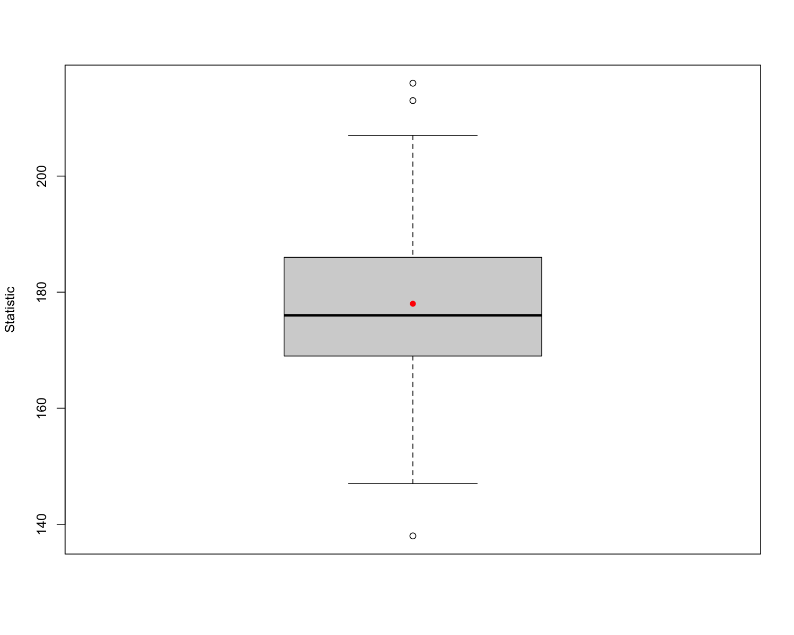

This does not converge.

19) Fit with preferential attachment term, fitting with star(2,3), including triangle term in model

```r
lolog_fit_1_19 <- lolog_fit(net,
                            terms = c("edges",
                                      "nodeCov('repeater_or_sweets_in','in')",
                                      "nodeCov('handicapped_in','in')",
                                      "nodeCov('rank_in','in')",
                                      "nodeCov('rank_out','out')",
                                      "edgeCov(edges_adj_rankdiff,'rankdiff')",
                                      "edgeCov(edges_adj_uprank,'uprank')",
                                      "triangles",
                                      #"star(c(2,3))",
                                      #"cTriple",
                                      #"twoPaths",
                                      "mutual",
                                      "preferentialAttachment(1)"),
                            gofit_terms = c("edges","degree(0:15,'out')","degree(0:15,'in')","esp(0:15)"),
                            fit_terms = c("star(c(2,3))"),
                            gofit_name = "lolog_1_19")
#> Initializing Using Variational Fit
#> Initial Theta:
#>  -3.065528 1.609914 -0.464212 0.007639286 0.0007272855 -0.006608615 0.5454982 0.2554712 2.001149 0.1445259 
#> 
#> 
#> Iteration 1 
#> Drawing 1000 Monte Carlo Samples:
#> ================================================================================
#> 
#> Objective:  5.559436 
#> Hotelling's T2 p-value:  < 1e-05 
#> 
#> 
#> Iteration 2 
#> Drawing 1000 Monte Carlo Samples:
#> ================================================================================
#> 
#> Objective:  4.305203 
#> Hotelling's T2 p-value:  < 1e-05 
#> 
#> 
#> Iteration 3 
#> Drawing 1000 Monte Carlo Samples:
#> ================================================================================
#> 
#> Objective:  3.464224 
#> Hotelling's T2 p-value:  < 1e-05 
#> 
#> 
#> Iteration 4 
#> Drawing 1000 Monte Carlo Samples:
#> ================================================================================
#> 
#> Objective:  3.637167 
#> Hotelling's T2 p-value:  < 1e-05 
#> 
#> 
#> Iteration 5 
#> Drawing 1000 Monte Carlo Samples:
#> ================================================================================
#> 
#> Objective:  2.962943 
#> Hotelling's T2 p-value:  < 1e-05 
#> 
#> 
#> Iteration 6 
#> Drawing 1000 Monte Carlo Samples:
#> ================================================================================
#> 
#> Objective:  2.226351 
#> Hotelling's T2 p-value:  < 1e-05 
#> 
#> 
#> Iteration 7 
#> Drawing 1000 Monte Carlo Samples:
#> ================================================================================
#> 
#> Objective:  1.487856 
#> Hotelling's T2 p-value:  < 1e-05 
#> 
#> 
#> Iteration 8 
#> Drawing 1000 Monte Carlo Samples:
#> ================================================================================
#> 
#> Objective:  2.025015 
#> Hotelling's T2 p-value:  < 1e-05 
#> 
#> 
#> Iteration 9 
#> Drawing 1000 Monte Carlo Samples:
#> ================================================================================
#> 
#> Objective:  1.461518 
#> Hotelling's T2 p-value:  < 1e-05 
#> 
#> 
#> Iteration 10 
#> Drawing 1000 Monte Carlo Samples:
#> ================================================================================
#> 
#> Objective:  1.639339 
#> Hotelling's T2 p-value:  < 1e-05 
#> 
#> 
#> Iteration 11 
#> Drawing 1000 Monte Carlo Samples:
#> ================================================================================
#> 
#> Objective:  8.277757 
#> Half Step Back
#> 
#> 
#> Iteration 12 
#> Drawing 1000 Monte Carlo Samples:
#> ================================================================================
#> 
#> Objective:  2.574499 
#> Half Step Back
#> 
#> 
#> Iteration 13 
#> Drawing 1000 Monte Carlo Samples:
#> ================================================================================
#> 
#> Objective:  1.907567 
#> Hotelling's T2 p-value:  < 1e-05 
#> 
#> 
#> Iteration 14 
#> Drawing 1000 Monte Carlo Samples:
#> ================================================================================
#> 
#> Objective:  1.819319 
#> Hotelling's T2 p-value:  < 1e-05 
#> 
#> 
#> Iteration 15 
#> Drawing 1000 Monte Carlo Samples:
#> ================================================================================
#> 
#> Objective:  5.783704 
#> Half Step Back
#> 
#> 
#> Iteration 16 
#> Drawing 1000 Monte Carlo Samples:
#> ================================================================================
#> 
#> Objective:  2.597641 
#> Hotelling's T2 p-value:  < 1e-05 
#> 
#> 
#> Iteration 17 
#> Drawing 1000 Monte Carlo Samples:
#> ================================================================================
#> 
#> Objective:  2.233427 
#> Hotelling's T2 p-value:  < 1e-05 
#> 
#> 
#> Iteration 18 
#> Drawing 1000 Monte Carlo Samples:
#> ================================================================================
#> 
#> Objective:  1.930514 
#> Hotelling's T2 p-value:  < 1e-05 
#> 
#> 
#> Iteration 19 
#> Drawing 1000 Monte Carlo Samples:
#> ================================================================================
#> 
#> Objective:  1.870736 
#> Hotelling's T2 p-value:  < 1e-05 
#> 
#> 
#> Iteration 20 
#> Drawing 1000 Monte Carlo Samples:
#> ================================================================================
#> 
#> Objective:  1.702623 
#> Hotelling's T2 p-value:  < 1e-05 
#> 
#> 
#> Iteration 21 
#> Drawing 1000 Monte Carlo Samples:
#> ================================================================================
#> 
#> Objective:  4.417846 
#> Half Step Back
#> 
#> 
#> Iteration 22 
#> Drawing 1000 Monte Carlo Samples:
#> ================================================================================
#> 
#> Objective:  1.93904 
#> Hotelling's T2 p-value:  < 1e-05 
#> 
#> 
#> Iteration 23 
#> Drawing 1000 Monte Carlo Samples:
#> ================================================================================
#> 
#> Objective:  1.629162 
#> Hotelling's T2 p-value:  < 1e-05 
#> 
#> 
#> Iteration 24 
#> Drawing 1000 Monte Carlo Samples:
#> ================================================================================
#> 
#> Objective:  1.486477 
#> Hotelling's T2 p-value:  < 1e-05 
#> 
#> 
#> Iteration 25 
#> Drawing 1000 Monte Carlo Samples:
#> ================================================================================
#> 
#> Objective:  1.534314 
#> Hotelling's T2 p-value:  < 1e-05 
#> 
#> 
#> Iteration 26 
#> Drawing 1000 Monte Carlo Samples:
#> ================================================================================
#> 
#> Objective:  2.446786 
#> Half Step Back
#> 
#> 
#> Iteration 27 
#> Drawing 1000 Monte Carlo Samples:
#> ================================================================================
#> 
#> Objective:  1.557003 
#> Hotelling's T2 p-value:  < 1e-05 
#> 
#> 
#> Iteration 28 
#> Drawing 1000 Monte Carlo Samples:
#> ================================================================================
#> 
#> Objective:  1.630572 
#> Hotelling's T2 p-value:  < 1e-05 
#> 
#> 
#> Iteration 29 
#> Drawing 1000 Monte Carlo Samples:
#> ================================================================================
#> 
#> Objective:  1.432251 
#> Hotelling's T2 p-value:  < 1e-05 
#> 
#> 
#> Iteration 30 
#> Drawing 1000 Monte Carlo Samples:
#> ================================================================================
#> 
#> Objective:  165.8904 
#> Half Step Back
#> 
#> 
#> Iteration 31 
#> Drawing 1000 Monte Carlo Samples:
#> ================================================================================
#> 
#> Objective:  45.59372 
#> Half Step Back
#> 
#> 
#> Iteration 32 
#> Drawing 1000 Monte Carlo Samples:
#> ================================================================================
#> 
#> Objective:  19.21157 
#> Half Step Back
#> 
#> 
#> Iteration 33 
#> Drawing 1000 Monte Carlo Samples:
#> ================================================================================
#> 
#> Objective:  6.250607 
#> Half Step Back
#> 
#> 
#> Iteration 34 
#> Drawing 1000 Monte Carlo Samples:
#> ================================================================================
#> 
#> Objective:  2.496656 
#> Half Step Back
#> 
#> 
#> Iteration 35 
#> Drawing 1000 Monte Carlo Samples:
#> ================================================================================
#> 
#> Objective:  1.787283 
#> Hotelling's T2 p-value:  < 1e-05 
#> 
#> 
#> Iteration 36 
#> Drawing 1000 Monte Carlo Samples:
#> ================================================================================
#> 
#> Objective:  1.737914 
#> Hotelling's T2 p-value:  < 1e-05 
#> 
#> 
#> Iteration 37 
#> Drawing 1000 Monte Carlo Samples:
#> ================================================================================
#> 
#> Objective:  1.548684 
#> Hotelling's T2 p-value:  < 1e-05 
#> 
#> 
#> Iteration 38 
#> Drawing 1000 Monte Carlo Samples:
#> ================================================================================
#> 
#> Objective:  1.646851 
#> Hotelling's T2 p-value:  < 1e-05 
#> 
#> 
#> Iteration 39 
#> Drawing 1000 Monte Carlo Samples:
#> ================================================================================
#> 
#> Objective:  1.787006 
#> Hotelling's T2 p-value:  < 1e-05 
#> 
#> 
#> Iteration 40 
#> Drawing 1000 Monte Carlo Samples:
#> ================================================================================
#> 
#> Objective:  1.619539 
#> Hotelling's T2 p-value:  < 1e-05 
#> 
#> 
#> Iteration 41 
#> Drawing 1000 Monte Carlo Samples:
#> ================================================================================
#> 
#> Objective:  1.690226 
#> Hotelling's T2 p-value:  < 1e-05 
#> 
#> 
#> Iteration 42 
#> Drawing 1000 Monte Carlo Samples:
#> ================================================================================
#> 
#> Objective:  1.578719 
#> Hotelling's T2 p-value:  < 1e-05 
#> 
#> 
#> Iteration 43 
#> Drawing 1000 Monte Carlo Samples:
#> ================================================================================
#> 
#> Objective:  1.86645 
#> Hotelling's T2 p-value:  < 1e-05 
#> 
#> 
#> Iteration 44 
#> Drawing 1000 Monte Carlo Samples:
#> ================================================================================
#> 
#> Objective:  1.371477 
#> Hotelling's T2 p-value:  < 1e-05 
#> 
#> 
#> Iteration 45 
#> Drawing 1000 Monte Carlo Samples:
#> ================================================================================
#> 
#> Objective:  1.482671 
#> Hotelling's T2 p-value:  < 1e-05 
#> 
#> 
#> Iteration 46 
#> Drawing 1000 Monte Carlo Samples:
#> ================================================================================
#> 
#> Objective:  1.631122 
#> Hotelling's T2 p-value:  < 1e-05 
#> 
#> 
#> Iteration 47 
#> Drawing 1000 Monte Carlo Samples:
#> ================================================================================
#> 
#> Objective:  1.451775 
#> Hotelling's T2 p-value:  < 1e-05 
#> 
#> 
#> Iteration 48 
#> Drawing 1000 Monte Carlo Samples:
#> ================================================================================
#> 
#> Objective:  1.458958 
#> Hotelling's T2 p-value:  < 1e-05 
#> 
#> 
#> Iteration 49 
#> Drawing 1000 Monte Carlo Samples:
#> ================================================================================
#> 
#> Objective:  6.014723 
#> Half Step Back
#> 
#> 
#> Iteration 50 
#> Drawing 1000 Monte Carlo Samples:
#> ================================================================================
#> 
#> Objective:  3.249428 
#> Half Step Back
#> 
#> 
#> Iteration 51 
#> Drawing 1000 Monte Carlo Samples:
#> ================================================================================
#> 
#> Objective:  1.802932 
#> Hotelling's T2 p-value:  < 1e-05 
#> 
#> 
#> Iteration 52 
#> Drawing 1000 Monte Carlo Samples:
#> ================================================================================
#> 
#> Objective:  1.854875 
#> Hotelling's T2 p-value:  < 1e-05 
#> 
#> 
#> Iteration 53 
#> Drawing 1000 Monte Carlo Samples:
#> ================================================================================
#> 
#> Objective:  1.469922 
#> Hotelling's T2 p-value:  < 1e-05 
#> 
#> 
#> Iteration 54 
#> Drawing 1000 Monte Carlo Samples:
#> ================================================================================
#> 
#> Objective:  1.455725 
#> Hotelling's T2 p-value:  < 1e-05 
#> 
#> 
#> Iteration 55 
#> Drawing 1000 Monte Carlo Samples:
#> ================================================================================
#> 
#> Objective:  1.456778 
#> Hotelling's T2 p-value:  < 1e-05 
#> 
#> 
#> Iteration 56 
#> Drawing 1000 Monte Carlo Samples:
#> ================================================================================
#> 
#> Objective:  3.004895 
#> Half Step Back
#> 
#> 
#> Iteration 57 
#> Drawing 1000 Monte Carlo Samples:
#> ================================================================================
#> 
#> Objective:  1.600133 
#> Hotelling's T2 p-value:  < 1e-05 
#> 
#> 
#> Iteration 58 
#> Drawing 1000 Monte Carlo Samples:
#> ================================================================================
#> 
#> Objective:  1.497672 
#> Hotelling's T2 p-value:  < 1e-05 
#> 
#> 
#> Iteration 59 
#> Drawing 1000 Monte Carlo Samples:
#> ================================================================================
#> 
#> Objective:  1.330472 
#> Hotelling's T2 p-value:  < 1e-05 
#> 
#> 
#> Iteration 60 
#> Drawing 1000 Monte Carlo Samples:
#> ================================================================================
#> 
#> Objective:  9.617217 
#> Half Step Back
#> 
#> 
#> Iteration 61 
#> Drawing 1000 Monte Carlo Samples:
#> ================================================================================
#> 
#> Objective:  4.121921 
#> Half Step Back
#> 
#> 
#> Iteration 62 
#> Drawing 1000 Monte Carlo Samples:
#> ================================================================================
#> 
#> Objective:  1.834334 
#> Hotelling's T2 p-value:  < 1e-05 
#> 
#> 
#> Iteration 63 
#> Drawing 1000 Monte Carlo Samples:
#> ================================================================================
#> 
#> Objective:  1.585336 
#> Hotelling's T2 p-value:  < 1e-05 
#> 
#> 
#> Iteration 64 
#> Drawing 1000 Monte Carlo Samples:
#> ================================================================================
#> 
#> Objective:  1.750591 
#> Hotelling's T2 p-value:  < 1e-05 
#> 
#> 
#> Iteration 65 
#> Drawing 1000 Monte Carlo Samples:
#> ================================================================================
#> 
#> Objective:  1.448119 
#> Hotelling's T2 p-value:  < 1e-05 
#> 
#> 
#> Iteration 66 
#> Drawing 1000 Monte Carlo Samples:
#> ================================================================================
#> 
#> Objective:  1.271173 
#> Hotelling's T2 p-value:  < 1e-05 
#> 
#> 
#> Iteration 67 
#> Drawing 1000 Monte Carlo Samples:
#> ================================================================================
#> 
#> Objective:  1.529209 
#> Hotelling's T2 p-value:  < 1e-05 
#> 
#> 
#> Iteration 68 
#> Drawing 1000 Monte Carlo Samples:
#> ================================================================================
#> 
#> Objective:  1.848657 
#> Hotelling's T2 p-value:  < 1e-05 
#> 
#> 
#> Iteration 69 
#> Drawing 1000 Monte Carlo Samples:
#> ================================================================================
#> 
#> Objective:  1.477954 
#> Hotelling's T2 p-value:  < 1e-05 
#> 
#> 
#> Iteration 70 
#> Drawing 1000 Monte Carlo Samples:
#> ================================================================================
#> 
#> Objective:  1.526436 
#> Hotelling's T2 p-value:  < 1e-05 
#> 
#> 
#> Iteration 71 
#> Drawing 1000 Monte Carlo Samples:
#> ================================================================================
#> 
#> Objective:  1.726077 
#> Hotelling's T2 p-value:  < 1e-05 
#> 
#> 
#> Iteration 72 
#> Drawing 1000 Monte Carlo Samples:
#> ================================================================================
#> 
#> Objective:  1.956163 
#> Hotelling's T2 p-value:  < 1e-05 
#> 
#> 
#> Iteration 73 
#> Drawing 1000 Monte Carlo Samples:
#> ================================================================================
#> 
#> Objective:  2.165115 
#> Hotelling's T2 p-value:  < 1e-05 
#> 
#> 
#> Iteration 74 
#> Drawing 1000 Monte Carlo Samples:
#> ================================================================================
#> 
#> Objective:  1.961718 
#> Hotelling's T2 p-value:  < 1e-05 
#> 
#> 
#> Iteration 75 
#> Drawing 1000 Monte Carlo Samples:
#> ================================================================================
#> 
#> Objective:  7.135067 
#> Half Step Back
#> 
#> 
#> Iteration 76 
#> Drawing 1000 Monte Carlo Samples:
#> ================================================================================
#> 
#> Objective:  2.321482 
#> Hotelling's T2 p-value:  < 1e-05 
#> 
#> 
#> Iteration 77 
#> Drawing 1000 Monte Carlo Samples:
#> ================================================================================
#> 
#> Objective:  1.798903 
#> Hotelling's T2 p-value:  < 1e-05 
#> 
#> 
#> Iteration 78 
#> Drawing 1000 Monte Carlo Samples:
#> ================================================================================
#> 
#> Objective:  1.73101 
#> Hotelling's T2 p-value:  < 1e-05 
#> 
#> 
#> Iteration 79 
#> Drawing 1000 Monte Carlo Samples:
#> ================================================================================
#> 
#> Objective:  1.68963 
#> Hotelling's T2 p-value:  < 1e-05 
#> 
#> 
#> Iteration 80 
#> Drawing 1000 Monte Carlo Samples:
#> ================================================================================
#> 
#> Objective:  1.763822 
#> Hotelling's T2 p-value:  < 1e-05 
#> 
#> 
#> Iteration 81 
#> Drawing 1000 Monte Carlo Samples:
#> ================================================================================
#> 
#> Objective:  2.341524 
#> Hotelling's T2 p-value:  < 1e-05 
#> 
#> 
#> Iteration 82 
#> Drawing 1000 Monte Carlo Samples:
#> ================================================================================
#> 
#> Objective:  1.69919 
#> Hotelling's T2 p-value:  < 1e-05 
#> 
#> 
#> Iteration 83 
#> Drawing 1000 Monte Carlo Samples:
#> ================================================================================
#> 
#> Objective:  1.466989 
#> Hotelling's T2 p-value:  < 1e-05 
#> 
#> 
#> Iteration 84 
#> Drawing 1000 Monte Carlo Samples:
#> ================================================================================
#> 
#> Objective:  45.81422 
#> Half Step Back
#> 
#> 
#> Iteration 85 
#> Drawing 1000 Monte Carlo Samples:
#> ================================================================================
#> 
#> Objective:  14.36508 
#> Half Step Back
#> 
#> 
#> Iteration 86 
#> Drawing 1000 Monte Carlo Samples:
#> ================================================================================
#> 
#> Objective:  3.810377 
#> Half Step Back
#> 
#> 
#> Iteration 87 
#> Drawing 1000 Monte Carlo Samples:
#> ================================================================================
#> 
#> Objective:  1.828488 
#> Hotelling's T2 p-value:  < 1e-05 
#> 
#> 
#> Iteration 88 
#> Drawing 1000 Monte Carlo Samples:
#> ================================================================================
#> 
#> Objective:  1.813892 
#> Hotelling's T2 p-value:  < 1e-05 
#> 
#> 
#> Iteration 89 
#> Drawing 1000 Monte Carlo Samples:
#> ================================================================================
#> 
#> Objective:  1.459643 
#> Hotelling's T2 p-value:  < 1e-05 
#> 
#> 
#> Iteration 90 
#> Drawing 1000 Monte Carlo Samples:
#> ================================================================================
#> 
#> Objective:  1.654976 
#> Hotelling's T2 p-value:  < 1e-05 
#> 
#> 
#> Iteration 91 
#> Drawing 1000 Monte Carlo Samples:
#> ================================================================================
#> 
#> Objective:  1.60089 
#> Hotelling's T2 p-value:  < 1e-05 
#> 
#> 
#> Iteration 92 
#> Drawing 1000 Monte Carlo Samples:
#> ================================================================================
#> 
#> Objective:  1.414925 
#> Hotelling's T2 p-value:  < 1e-05 
#> 
#> 
#> Iteration 93 
#> Drawing 1000 Monte Carlo Samples:
#> ================================================================================
#> 
#> Objective:  1.423913 
#> Hotelling's T2 p-value:  < 1e-05 
#> 
#> 
#> Iteration 94 
#> Drawing 1000 Monte Carlo Samples:
#> ================================================================================
#> 
#> Objective:  11.4809 
#> Half Step Back
#> 
#> 
#> Iteration 95 
#> Drawing 1000 Monte Carlo Samples:
#> ================================================================================
#> 
#> Objective:  4.147918 
#> Half Step Back
#> 
#> 
#> Iteration 96 
#> Drawing 1000 Monte Carlo Samples:
#> ================================================================================
#> 
#> Objective:  1.769276 
#> Hotelling's T2 p-value:  < 1e-05 
#> 
#> 
#> Iteration 97 
#> Drawing 1000 Monte Carlo Samples:
#> ================================================================================
#> 
#> Objective:  1.665272 
#> Hotelling's T2 p-value:  < 1e-05 
#> 
#> 
#> Iteration 98 
#> Drawing 1000 Monte Carlo Samples:
#> ================================================================================
#> 
#> Objective:  1.491146 
#> Hotelling's T2 p-value:  < 1e-05 
#> 
#> 
#> Iteration 99 
#> Drawing 1000 Monte Carlo Samples:
#> ================================================================================
#> 
#> Objective:  1.445549 
#> Hotelling's T2 p-value:  < 1e-05 
#> 
#> 
#> Iteration 100 
#> Drawing 1000 Monte Carlo Samples:
#> ================================================================================
#> 
#> Objective:  1.238565 
#> Hotelling's T2 p-value:  < 1e-05
#> Warning in if (length(model) <= 1 & is.na(model)) {: the condition has length >
#> 1 and only the first element will be used
#> Note: Cannot create line plot with only one statistic. Falling back to boxplot
```

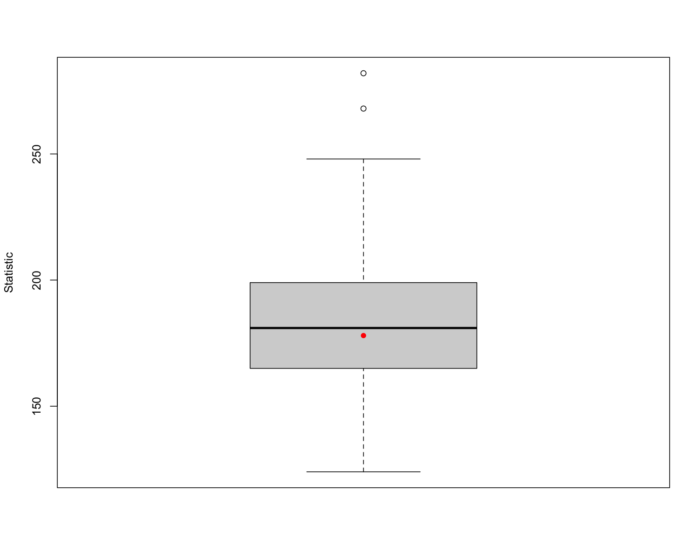

This does not converge

20) Fit with preferential attachment term, fitting with star(2,3), including triangle term in model

Try with higher values of k:
* 1  - didn't work
* 10 - didn't work
* 15 - didn't work
* 5  - didn't work
* 2  - didn't work


```r
lolog_fit_1_20 <- lolog_fit(net,
                            terms = c("edges",
                                      "nodeCov('repeater_or_sweets_in','in')",
                                      "nodeCov('handicapped_in','in')",
                                      "nodeCov('rank_in','in')",
                                      "nodeCov('rank_out','out')",
                                      "edgeCov(edges_adj_rankdiff,'rankdiff')",
                                      "edgeCov(edges_adj_uprank,'uprank')",
                                      "triangles",
                                      #"star(c(2,3))",
                                      #"cTriple",
                                      #"twoPaths",
                                      "mutual",
                                      "preferentialAttachment(2)"),
                            gofit_terms = c("edges","degree(0:15,'out')","degree(0:15,'in')","esp(0:15)"),
                            fit_terms = c("star(c(2,3))"),
                            gofit_name = "lolog_1_20")
#> Initializing Using Variational Fit
#> Initial Theta:
#>  -3.394008 1.648489 -0.5430762 0.008109784 0.001432653 -0.005996911 0.5701218 0.229259 2.126398 0.07936015 
#> 
#> 
#> Iteration 1 
#> Drawing 1000 Monte Carlo Samples:
#> ================================================================================
#> 
#> Objective:  9.041715 
#> Hotelling's T2 p-value:  < 1e-05 
#> 
#> 
#> Iteration 2 
#> Drawing 1000 Monte Carlo Samples:
#> ================================================================================
#> 
#> Objective:  5.753166 
#> Hotelling's T2 p-value:  < 1e-05 
#> 
#> 
#> Iteration 3 
#> Drawing 1000 Monte Carlo Samples:
#> ================================================================================
#> 
#> Objective:  4.004101 
#> Hotelling's T2 p-value:  < 1e-05 
#> 
#> 
#> Iteration 4 
#> Drawing 1000 Monte Carlo Samples:
#> ================================================================================
#> 
#> Objective:  2.666288 
#> Hotelling's T2 p-value:  < 1e-05 
#> 
#> 
#> Iteration 5 
#> Drawing 1000 Monte Carlo Samples:
#> ================================================================================
#> 
#> Objective:  1.971061 
#> Hotelling's T2 p-value:  < 1e-05 
#> 
#> 
#> Iteration 6 
#> Drawing 1000 Monte Carlo Samples:
#> ================================================================================
#> 
#> Objective:  2.17884 
#> Hotelling's T2 p-value:  < 1e-05 
#> 
#> 
#> Iteration 7 
#> Drawing 1000 Monte Carlo Samples:
#> ================================================================================
#> 
#> Objective:  1.813996 
#> Hotelling's T2 p-value:  < 1e-05 
#> 
#> 
#> Iteration 8 
#> Drawing 1000 Monte Carlo Samples:
#> ================================================================================
#> 
#> Objective:  1.596345 
#> Hotelling's T2 p-value:  < 1e-05 
#> 
#> 
#> Iteration 9 
#> Drawing 1000 Monte Carlo Samples:
#> ================================================================================
#> 
#> Objective:  2.697907 
#> Half Step Back
#> 
#> 
#> Iteration 10 
#> Drawing 1000 Monte Carlo Samples:
#> ================================================================================
#> 
#> Objective:  1.832325 
#> Hotelling's T2 p-value:  < 1e-05 
#> 
#> 
#> Iteration 11 
#> Drawing 1000 Monte Carlo Samples:
#> ================================================================================
#> 
#> Objective:  1.661687 
#> Hotelling's T2 p-value:  < 1e-05 
#> 
#> 
#> Iteration 12 
#> Drawing 1000 Monte Carlo Samples:
#> ================================================================================
#> 
#> Objective:  2.042518 
#> Hotelling's T2 p-value:  < 1e-05 
#> 
#> 
#> Iteration 13 
#> Drawing 1000 Monte Carlo Samples:
#> ================================================================================
#> 
#> Objective:  1.390848 
#> Hotelling's T2 p-value:  < 1e-05 
#> 
#> 
#> Iteration 14 
#> Drawing 1000 Monte Carlo Samples:
#> ================================================================================
#> 
#> Objective:  1.727309 
#> Hotelling's T2 p-value:  < 1e-05 
#> 
#> 
#> Iteration 15 
#> Drawing 1000 Monte Carlo Samples:
#> ================================================================================
#> 
#> Objective:  1.202369 
#> Hotelling's T2 p-value:  < 1e-05 
#> 
#> 
#> Iteration 16 
#> Drawing 1000 Monte Carlo Samples:
#> ================================================================================
#> 
#> Objective:  1.603292 
#> Hotelling's T2 p-value:  < 1e-05 
#> 
#> 
#> Iteration 17 
#> Drawing 1000 Monte Carlo Samples:
#> ================================================================================
#> 
#> Objective:  2.736449 
#> Half Step Back
#> 
#> 
#> Iteration 18 
#> Drawing 1000 Monte Carlo Samples:
#> ================================================================================
#> 
#> Objective:  1.829457 
#> Hotelling's T2 p-value:  < 1e-05 
#> 
#> 
#> Iteration 19 
#> Drawing 1000 Monte Carlo Samples:
#> ================================================================================
#> 
#> Objective:  1.68225 
#> Hotelling's T2 p-value:  < 1e-05 
#> 
#> 
#> Iteration 20 
#> Drawing 1000 Monte Carlo Samples:
#> ================================================================================
#> 
#> Objective:  4.153846 
#> Half Step Back
#> 
#> 
#> Iteration 21 
#> Drawing 1000 Monte Carlo Samples:
#> ================================================================================
#> 
#> Objective:  1.978449 
#> Hotelling's T2 p-value:  < 1e-05 
#> 
#> 
#> Iteration 22 
#> Drawing 1000 Monte Carlo Samples:
#> ================================================================================
#> 
#> Objective:  1.554707 
#> Hotelling's T2 p-value:  < 1e-05 
#> 
#> 
#> Iteration 23 
#> Drawing 1000 Monte Carlo Samples:
#> ================================================================================
#> 
#> Objective:  1.330548 
#> Hotelling's T2 p-value:  < 1e-05 
#> 
#> 
#> Iteration 24 
#> Drawing 1000 Monte Carlo Samples:
#> ================================================================================
#> 
#> Objective:  1.857561 
#> Hotelling's T2 p-value:  < 1e-05 
#> 
#> 
#> Iteration 25 
#> Drawing 1000 Monte Carlo Samples:
#> ================================================================================
#> 
#> Objective:  1.897196 
#> Hotelling's T2 p-value:  < 1e-05 
#> 
#> 
#> Iteration 26 
#> Drawing 1000 Monte Carlo Samples:
#> ================================================================================
#> 
#> Objective:  2.689089 
#> Hotelling's T2 p-value:  < 1e-05 
#> 
#> 
#> Iteration 27 
#> Drawing 1000 Monte Carlo Samples:
#> ================================================================================
#> 
#> Objective:  1.609849 
#> Hotelling's T2 p-value:  < 1e-05 
#> 
#> 
#> Iteration 28 
#> Drawing 1000 Monte Carlo Samples:
#> ================================================================================
#> 
#> Objective:  1.428763 
#> Hotelling's T2 p-value:  < 1e-05 
#> 
#> 
#> Iteration 29 
#> Drawing 1000 Monte Carlo Samples:
#> ================================================================================
#> 
#> Objective:  220.6533 
#> Half Step Back
#> 
#> 
#> Iteration 30 
#> Drawing 1000 Monte Carlo Samples:
#> ================================================================================
#> 
#> Objective:  21.28963 
#> Half Step Back
#> 
#> 
#> Iteration 31 
#> Drawing 1000 Monte Carlo Samples:
#> ================================================================================
#> 
#> Objective:  4.664483 
#> Half Step Back
#> 
#> 
#> Iteration 32 
#> Drawing 1000 Monte Carlo Samples:
#> ================================================================================
#> 
#> Objective:  2.382796 
#> Half Step Back
#> 
#> 
#> Iteration 33 
#> Drawing 1000 Monte Carlo Samples:
#> ================================================================================
#> 
#> Objective:  1.478821 
#> Hotelling's T2 p-value:  < 1e-05 
#> 
#> 
#> Iteration 34 
#> Drawing 1000 Monte Carlo Samples:
#> ================================================================================
#> 
#> Objective:  1.417701 
#> Hotelling's T2 p-value:  < 1e-05 
#> 
#> 
#> Iteration 35 
#> Drawing 1000 Monte Carlo Samples:
#> ================================================================================
#> 
#> Objective:  1.579852 
#> Hotelling's T2 p-value:  < 1e-05 
#> 
#> 
#> Iteration 36 
#> Drawing 1000 Monte Carlo Samples:
#> ================================================================================
#> 
#> Objective:  1.384867 
#> Hotelling's T2 p-value:  < 1e-05 
#> 
#> 
#> Iteration 37 
#> Drawing 1000 Monte Carlo Samples:
#> ================================================================================
#> 
#> Objective:  1.614684 
#> Hotelling's T2 p-value:  < 1e-05 
#> 
#> 
#> Iteration 38 
#> Drawing 1000 Monte Carlo Samples:
#> ================================================================================
#> 
#> Objective:  1.856892 
#> Hotelling's T2 p-value:  < 1e-05 
#> 
#> 
#> Iteration 39 
#> Drawing 1000 Monte Carlo Samples:
#> ================================================================================
#> 
#> Objective:  1.546018 
#> Hotelling's T2 p-value:  < 1e-05 
#> 
#> 
#> Iteration 40 
#> Drawing 1000 Monte Carlo Samples:
#> ================================================================================
#> 
#> Objective:  1.92299 
#> Hotelling's T2 p-value:  < 1e-05 
#> 
#> 
#> Iteration 41 
#> Drawing 1000 Monte Carlo Samples:
#> ================================================================================
#> 
#> Objective:  1.598723 
#> Hotelling's T2 p-value:  < 1e-05 
#> 
#> 
#> Iteration 42 
#> Drawing 1000 Monte Carlo Samples:
#> ================================================================================
#> 
#> Objective:  1.768846 
#> Hotelling's T2 p-value:  < 1e-05 
#> 
#> 
#> Iteration 43 
#> Drawing 1000 Monte Carlo Samples:
#> ================================================================================
#> 
#> Objective:  1.458985 
#> Hotelling's T2 p-value:  < 1e-05 
#> 
#> 
#> Iteration 44 
#> Drawing 1000 Monte Carlo Samples:
#> ================================================================================
#> 
#> Objective:  4.125008 
#> Half Step Back
#> 
#> 
#> Iteration 45 
#> Drawing 1000 Monte Carlo Samples:
#> ================================================================================
#> 
#> Objective:  1.800776 
#> Hotelling's T2 p-value:  < 1e-05 
#> 
#> 
#> Iteration 46 
#> Drawing 1000 Monte Carlo Samples:
#> ================================================================================
#> 
#> Objective:  1.320105 
#> Hotelling's T2 p-value:  < 1e-05 
#> 
#> 
#> Iteration 47 
#> Drawing 1000 Monte Carlo Samples:
#> ================================================================================
#> 
#> Objective:  1.274826 
#> Hotelling's T2 p-value:  < 1e-05 
#> 
#> 
#> Iteration 48 
#> Drawing 1000 Monte Carlo Samples:
#> ================================================================================
#> 
#> Objective:  2.164444 
#> Half Step Back
#> 
#> 
#> Iteration 49 
#> Drawing 1000 Monte Carlo Samples:
#> ================================================================================
#> 
#> Objective:  1.748957 
#> Hotelling's T2 p-value:  < 1e-05 
#> 
#> 
#> Iteration 50 
#> Drawing 1000 Monte Carlo Samples:
#> ================================================================================
#> 
#> Objective:  1.608265 
#> Hotelling's T2 p-value:  < 1e-05 
#> 
#> 
#> Iteration 51 
#> Drawing 1000 Monte Carlo Samples:
#> ================================================================================
#> 
#> Objective:  3.413774 
#> Half Step Back
#> 
#> 
#> Iteration 52 
#> Drawing 1000 Monte Carlo Samples:
#> ================================================================================
#> 
#> Objective:  1.593134 
#> Hotelling's T2 p-value:  < 1e-05 
#> 
#> 
#> Iteration 53 
#> Drawing 1000 Monte Carlo Samples:
#> ================================================================================
#> 
#> Objective:  1.460207 
#> Hotelling's T2 p-value:  < 1e-05 
#> 
#> 
#> Iteration 54 
#> Drawing 1000 Monte Carlo Samples:
#> ================================================================================
#> 
#> Objective:  1.611779 
#> Hotelling's T2 p-value:  < 1e-05 
#> 
#> 
#> Iteration 55 
#> Drawing 1000 Monte Carlo Samples:
#> ================================================================================
#> 
#> Objective:  1.388228 
#> Hotelling's T2 p-value:  < 1e-05 
#> 
#> 
#> Iteration 56 
#> Drawing 1000 Monte Carlo Samples:
#> ================================================================================
#> 
#> Objective:  3.013651 
#> Half Step Back
#> 
#> 
#> Iteration 57 
#> Drawing 1000 Monte Carlo Samples:
#> ================================================================================
#> 
#> Objective:  1.476738 
#> Hotelling's T2 p-value:  < 1e-05 
#> 
#> 
#> Iteration 58 
#> Drawing 1000 Monte Carlo Samples:
#> ================================================================================
#> 
#> Objective:  1.562437 
#> Hotelling's T2 p-value:  < 1e-05 
#> 
#> 
#> Iteration 59 
#> Drawing 1000 Monte Carlo Samples:
#> ================================================================================
#> 
#> Objective:  1.236397 
#> Hotelling's T2 p-value:  < 1e-05 
#> 
#> 
#> Iteration 60 
#> Drawing 1000 Monte Carlo Samples:
#> ================================================================================
#> 
#> Objective:  1.312597 
#> Hotelling's T2 p-value:  < 1e-05 
#> 
#> 
#> Iteration 61 
#> Drawing 1000 Monte Carlo Samples:
#> ================================================================================
#> 
#> Objective:  1.095922 
#> Hotelling's T2 p-value:  < 1e-05 
#> 
#> 
#> Iteration 62 
#> Drawing 1000 Monte Carlo Samples:
#> ================================================================================
#> 
#> Objective:  2.084123 
#> Half Step Back
#> 
#> 
#> Iteration 63 
#> Drawing 1000 Monte Carlo Samples:
#> ================================================================================
#> 
#> Objective:  1.362521 
#> Hotelling's T2 p-value:  < 1e-05 
#> 
#> 
#> Iteration 64 
#> Drawing 1000 Monte Carlo Samples:
#> ================================================================================
#> 
#> Objective:  1.282276 
#> Hotelling's T2 p-value:  < 1e-05 
#> 
#> 
#> Iteration 65 
#> Drawing 1000 Monte Carlo Samples:
#> ================================================================================
#> 
#> Objective:  8.372881 
#> Half Step Back
#> 
#> 
#> Iteration 66 
#> Drawing 1000 Monte Carlo Samples:
#> ================================================================================
#> 
#> Objective:  2.516769 
#> Half Step Back
#> 
#> 
#> Iteration 67 
#> Drawing 1000 Monte Carlo Samples:
#> ================================================================================
#> 
#> Objective:  1.552275 
#> Hotelling's T2 p-value:  < 1e-05 
#> 
#> 
#> Iteration 68 
#> Drawing 1000 Monte Carlo Samples:
#> ================================================================================
#> 
#> Objective:  1.390248 
#> Hotelling's T2 p-value:  < 1e-05 
#> 
#> 
#> Iteration 69 
#> Drawing 1000 Monte Carlo Samples:
#> ================================================================================
#> 
#> Objective:  1.607964 
#> Hotelling's T2 p-value:  < 1e-05 
#> 
#> 
#> Iteration 70 
#> Drawing 1000 Monte Carlo Samples:
#> ================================================================================
#> 
#> Objective:  1.396961 
#> Hotelling's T2 p-value:  < 1e-05 
#> 
#> 
#> Iteration 71 
#> Drawing 1000 Monte Carlo Samples:
#> ================================================================================
#> 
#> Objective:  1.29665 
#> Hotelling's T2 p-value:  < 1e-05 
#> 
#> 
#> Iteration 72 
#> Drawing 1000 Monte Carlo Samples:
#> ================================================================================
#> 
#> Objective:  2.224935 
#> Half Step Back
#> 
#> 
#> Iteration 73 
#> Drawing 1000 Monte Carlo Samples:
#> ================================================================================
#> 
#> Objective:  1.565969 
#> Hotelling's T2 p-value:  < 1e-05 
#> 
#> 
#> Iteration 74 
#> Drawing 1000 Monte Carlo Samples:
#> ================================================================================
#> 
#> Objective:  1.418023 
#> Hotelling's T2 p-value:  < 1e-05 
#> 
#> 
#> Iteration 75 
#> Drawing 1000 Monte Carlo Samples:
#> ================================================================================
#> 
#> Objective:  2.473391 
#> Half Step Back
#> 
#> 
#> Iteration 76 
#> Drawing 1000 Monte Carlo Samples:
#> ================================================================================
#> 
#> Objective:  1.641798 
#> Hotelling's T2 p-value:  < 1e-05 
#> 
#> 
#> Iteration 77 
#> Drawing 1000 Monte Carlo Samples:
#> ================================================================================
#> 
#> Objective:  1.597983 
#> Hotelling's T2 p-value:  < 1e-05 
#> 
#> 
#> Iteration 78 
#> Drawing 1000 Monte Carlo Samples:
#> ================================================================================
#> 
#> Objective:  1.895451 
#> Hotelling's T2 p-value:  < 1e-05 
#> 
#> 
#> Iteration 79 
#> Drawing 1000 Monte Carlo Samples:
#> ================================================================================
#> 
#> Objective:  1.45878 
#> Hotelling's T2 p-value:  < 1e-05 
#> 
#> 
#> Iteration 80 
#> Drawing 1000 Monte Carlo Samples:
#> ================================================================================
#> 
#> Objective:  2.157436 
#> Hotelling's T2 p-value:  < 1e-05 
#> 
#> 
#> Iteration 81 
#> Drawing 1000 Monte Carlo Samples:
#> ================================================================================
#> 
#> Objective:  1.856499 
#> Hotelling's T2 p-value:  < 1e-05 
#> 
#> 
#> Iteration 82 
#> Drawing 1000 Monte Carlo Samples:
#> ================================================================================
#> 
#> Objective:  1.415073 
#> Hotelling's T2 p-value:  < 1e-05 
#> 
#> 
#> Iteration 83 
#> Drawing 1000 Monte Carlo Samples:
#> ================================================================================
#> 
#> Objective:  1.885609 
#> Hotelling's T2 p-value:  < 1e-05 
#> 
#> 
#> Iteration 84 
#> Drawing 1000 Monte Carlo Samples:
#> ================================================================================
#> 
#> Objective:  1.601201 
#> Hotelling's T2 p-value:  < 1e-05 
#> 
#> 
#> Iteration 85 
#> Drawing 1000 Monte Carlo Samples:
#> ================================================================================
#> 
#> Objective:  11.96886 
#> Half Step Back
#> 
#> 
#> Iteration 86 
#> Drawing 1000 Monte Carlo Samples:
#> ================================================================================
#> 
#> Objective:  4.743145 
#> Half Step Back
#> 
#> 
#> Iteration 87 
#> Drawing 1000 Monte Carlo Samples:
#> ================================================================================
#> 
#> Objective:  1.950846 
#> Hotelling's T2 p-value:  < 1e-05 
#> 
#> 
#> Iteration 88 
#> Drawing 1000 Monte Carlo Samples:
#> ================================================================================
#> 
#> Objective:  2.147116 
#> Hotelling's T2 p-value:  < 1e-05 
#> 
#> 
#> Iteration 89 
#> Drawing 1000 Monte Carlo Samples:
#> ================================================================================
#> 
#> Objective:  1.485451 
#> Hotelling's T2 p-value:  < 1e-05 
#> 
#> 
#> Iteration 90 
#> Drawing 1000 Monte Carlo Samples:
#> ================================================================================
#> 
#> Objective:  1.526165 
#> Hotelling's T2 p-value:  < 1e-05 
#> 
#> 
#> Iteration 91 
#> Drawing 1000 Monte Carlo Samples:
#> ================================================================================
#> 
#> Objective:  1.315496 
#> Hotelling's T2 p-value:  < 1e-05 
#> 
#> 
#> Iteration 92 
#> Drawing 1000 Monte Carlo Samples:
#> ================================================================================
#> 
#> Objective:  1.51522 
#> Hotelling's T2 p-value:  < 1e-05 
#> 
#> 
#> Iteration 93 
#> Drawing 1000 Monte Carlo Samples:
#> ================================================================================
#> 
#> Objective:  1.458321 
#> Hotelling's T2 p-value:  < 1e-05 
#> 
#> 
#> Iteration 94 
#> Drawing 1000 Monte Carlo Samples:
#> ================================================================================
#> 
#> Objective:  3.144904 
#> Half Step Back
#> 
#> 
#> Iteration 95 
#> Drawing 1000 Monte Carlo Samples:
#> ================================================================================
#> 
#> Objective:  1.977693 
#> Hotelling's T2 p-value:  < 1e-05 
#> 
#> 
#> Iteration 96 
#> Drawing 1000 Monte Carlo Samples:
#> ================================================================================
#> 
#> Objective:  1.467795 
#> Hotelling's T2 p-value:  < 1e-05 
#> 
#> 
#> Iteration 97 
#> Drawing 1000 Monte Carlo Samples:
#> ================================================================================
#> 
#> Objective:  1.833091 
#> Hotelling's T2 p-value:  < 1e-05 
#> 
#> 
#> Iteration 98 
#> Drawing 1000 Monte Carlo Samples:
#> ================================================================================
#> 
#> Objective:  1.300008 
#> Hotelling's T2 p-value:  < 1e-05 
#> 
#> 
#> Iteration 99 
#> Drawing 1000 Monte Carlo Samples:
#> ================================================================================
#> 
#> Objective:  4.538366 
#> Half Step Back
#> 
#> 
#> Iteration 100 
#> Drawing 1000 Monte Carlo Samples:
#> ================================================================================
#> 
#> Objective:  1.707132 
#> Hotelling's T2 p-value:  < 1e-05
#> Warning in if (length(model) <= 1 & is.na(model)) {: the condition has length >
#> 1 and only the first element will be used
#> Note: Cannot create line plot with only one statistic. Falling back to boxplot
```

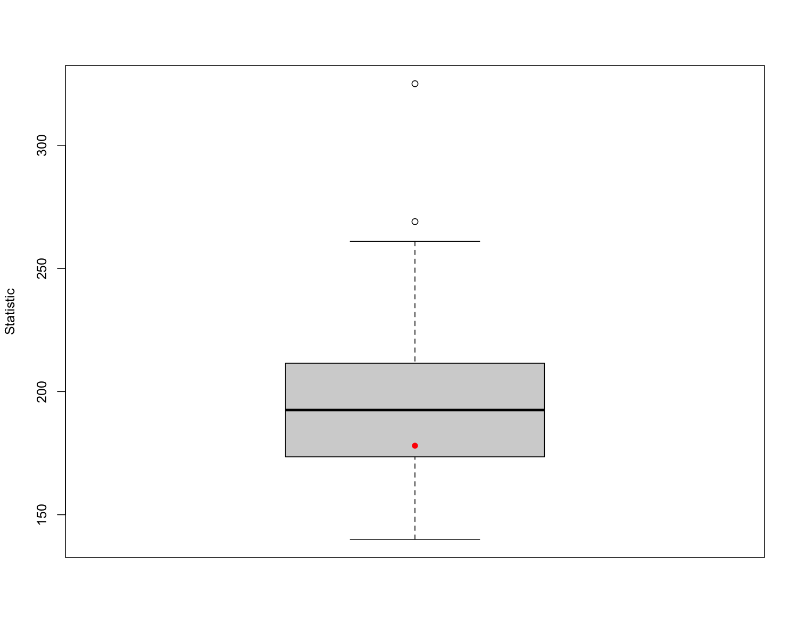

21) Fit with preferential attachment term, fitting with star(2,3), and triangles.

Remove all other structural terms. It didn't work

So:
* Remove nodeCov(rank_in)
* Remove nodeCov(rank_in) and uprank


```r
lolog_fit_1_21 <- lolog_fit(net,
                            terms = c("edges",
                                      #"nodeCov('repeater_or_sweets_in','in')",
                                      #"nodeCov('handicapped_in','in')",
                                      #"nodeCov('rank_in','in')",
                                      #"nodeCov('rank_out','out')",
                                      #"edgeCov(edges_adj_rankdiff,'rankdiff')",
                                      #"edgeCov(edges_adj_uprank,'uprank')",
                                      #"triangles",
                                      #"star(c(2,3))",
                                      #"cTriple",
                                      #"twoPaths",
                                      #"mutual",
                                      "preferentialAttachment(1)"),
                            gofit_terms = c("edges","degree(0:15,'out')","degree(0:15,'in')","esp(0:15)"),
                            fit_terms = c("star(c(2,3))","triangles"),
                            gofit_name = "lolog_1_21")
#> Initializing Using Variational Fit
#> Initial Theta:
#>  -1.084224 0.3906679 
#> 
#> 
#> Iteration 1 
#> Drawing 1000 Monte Carlo Samples:
#> ================================================================================
#> 
#> Objective:  393.9979 
#> Hotelling's T2 p-value:  < 1e-05 
#> 
#> 
#> Iteration 2 
#> Drawing 1000 Monte Carlo Samples:
#> ================================================================================
#> 
#> Objective:  42.77767 
#> Hotelling's T2 p-value:  < 1e-05 
#> 
#> 
#> Iteration 3 
#> Drawing 1000 Monte Carlo Samples:
#> ================================================================================
#> 
#> Objective:  23.15819 
#> Hotelling's T2 p-value:  < 1e-05 
#> 
#> 
#> Iteration 4 
#> Drawing 1000 Monte Carlo Samples:
#> ================================================================================
#> 
#> Objective:  10.06164 
#> Hotelling's T2 p-value:  < 1e-05 
#> 
#> 
#> Iteration 5 
#> Drawing 1000 Monte Carlo Samples:
#> ================================================================================
#> 
#> Objective:  6.472565 
#> Hotelling's T2 p-value:  < 1e-05 
#> 
#> 
#> Iteration 6 
#> Drawing 1000 Monte Carlo Samples:
#> ================================================================================
#> 
#> Objective:  3.848141 
#> Hotelling's T2 p-value:  < 1e-05 
#> 
#> 
#> Iteration 7 
#> Drawing 1000 Monte Carlo Samples:
#> ================================================================================
#> 
#> Objective:  2.205123 
#> Hotelling's T2 p-value:  < 1e-05 
#> 
#> 
#> Iteration 8 
#> Drawing 1000 Monte Carlo Samples:
#> ================================================================================
#> 
#> Objective:  1.554278 
#> Hotelling's T2 p-value:  < 1e-05 
#> 
#> 
#> Iteration 9 
#> Drawing 1000 Monte Carlo Samples:
#> ================================================================================
#> 
#> Objective:  1.339947 
#> Hotelling's T2 p-value:  < 1e-05 
#> 
#> 
#> Iteration 10 
#> Drawing 1000 Monte Carlo Samples:
#> ================================================================================
#> 
#> Objective:  1.421857 
#> Hotelling's T2 p-value:  0.03151 
#> 
#> 
#> Iteration 11 
#> Drawing 1000 Monte Carlo Samples:
#> ================================================================================
#> 
#> Objective:  1.155489 
#> Hotelling's T2 p-value:  0.012545 
#> 
#> 
#> Iteration 12 
#> Drawing 1000 Monte Carlo Samples:
#> ================================================================================
#> 
#> Objective:  1.424619 
#> Hotelling's T2 p-value:  0.070138 
#> 
#> 
#> Iteration 13 
#> Drawing 1000 Monte Carlo Samples:
#> ================================================================================
#> 
#> Objective:  1.176854 
#> Hotelling's T2 p-value:  0.093822 
#> 
#> 
#> Iteration 14 
#> Drawing 1000 Monte Carlo Samples:
#> ================================================================================
#> 
#> Objective:  1.356938 
#> Hotelling's T2 p-value:  0.53769
#> Warning in if (length(model) <= 1 & is.na(model)) {: the condition has length >
#> 1 and only the first element will be used
#> Note: Cannot create line plot with only one statistic. Falling back to boxplot
```

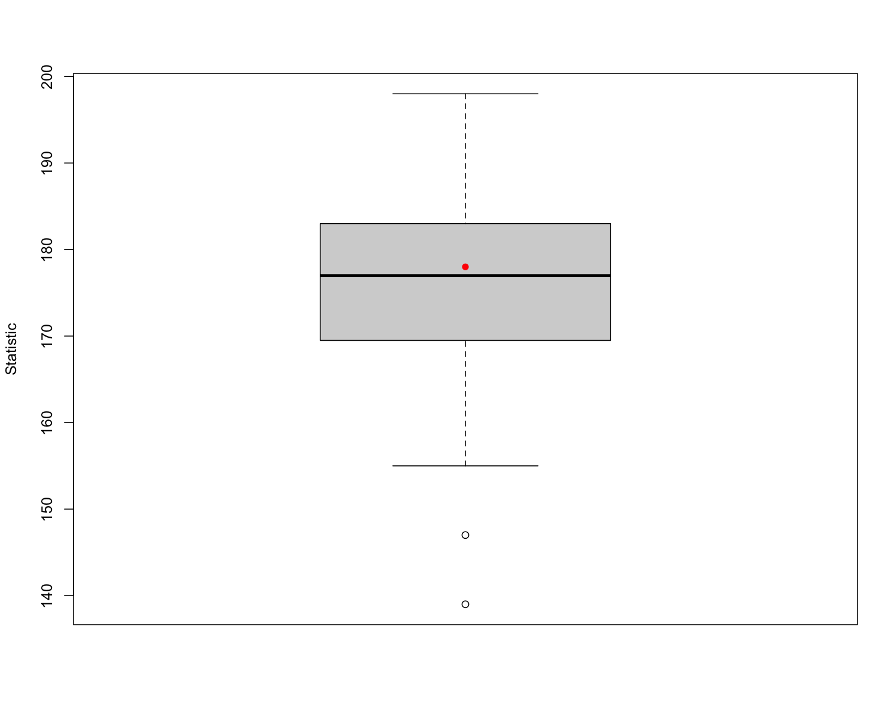

22) Try to use our best LOLOG fit with some ordering.

Suspect there is some ordering process, first idea is that repeaters and sweet givers come into social
contact with other students first therefore their friendship ties form first
may or may not be plausible - see if it provides a better fit.


```r
repeater_or_sweets <- (net %v% "repeater_or_sweets")
repeater_or_sweets[repeater_or_sweets == 0] <- 2

lolog_fit_1_22 <- lolog_fit(net,
                            terms = c("edges",
                                      "nodeCov('repeater_or_sweets_in','in')",
                                      "nodeCov('handicapped_in','in')",
                                      "nodeCov('rank_in','in')",
                                      "nodeCov('rank_out','out')",
                                      "edgeCov(edges_adj_rankdiff,'rankdiff')",
                                      "edgeCov(edges_adj_uprank,'uprank')",
                                      #"triangles",
                                      "star(c(2,3))",
                                      "cTriple",
                                      #"twoPaths",
                                      "tTriple",
                                      "mutual"),
                            gofit_terms = c("edges","degree(0:15,'out')","degree(0:15,'in')","esp(0:15)"),
                            gofit_name = "lolog_1_22",
                            vertex_order = "repeater_or_sweets")
#> Initializing Using Variational Fit
#> Initial Theta:
#>  -3.762635 1.442752 -0.4829016 0.008876769 0.0006333293 -0.007158227 0.5788839 0.1087862 -0.02623137 -0.1733602 0.3648685 2.273904 
#> 
#> 
#> Iteration 1 
#> Drawing 1000 Monte Carlo Samples:
#> ================================================================================
#> 
#> Objective:  25.47219 
#> Hotelling's T2 p-value:  < 1e-05 
#> 
#> 
#> Iteration 2 
#> Drawing 1000 Monte Carlo Samples:
#> ================================================================================
#> 
#> Objective:  13.03395 
#> Hotelling's T2 p-value:  < 1e-05 
#> 
#> 
#> Iteration 3 
#> Drawing 1000 Monte Carlo Samples:
#> ================================================================================
#> 
#> Objective:  7.612327 
#> Hotelling's T2 p-value:  < 1e-05 
#> 
#> 
#> Iteration 4 
#> Drawing 1000 Monte Carlo Samples:
#> ================================================================================
#> 
#> Objective:  3.322336 
#> Hotelling's T2 p-value:  < 1e-05 
#> 
#> 
#> Iteration 5 
#> Drawing 1000 Monte Carlo Samples:
#> ================================================================================
#> 
#> Objective:  1.724029 
#> Hotelling's T2 p-value:  < 1e-05 
#> 
#> 
#> Iteration 6 
#> Drawing 1000 Monte Carlo Samples:
#> ================================================================================
#> 
#> Objective:  0.7359417 
#> Hotelling's T2 p-value:  < 1e-05 
#> 
#> 
#> Iteration 7 
#> Drawing 1000 Monte Carlo Samples:
#> ================================================================================
#> 
#> Objective:  0.2463271 
#> Hotelling's T2 p-value:  < 1e-05 
#> 
#> 
#> Iteration 8 
#> Drawing 1000 Monte Carlo Samples:
#> ================================================================================
#> 
#> Objective:  0.07017287 
#> Hotelling's T2 p-value:  < 1e-05 
#> 
#> 
#> Iteration 9 
#> Drawing 1000 Monte Carlo Samples:
#> ================================================================================
#> 
#> Objective:  0.02857209 
#> Hotelling's T2 p-value:  0.0045586 
#> 
#> 
#> Iteration 10 
#> Drawing 1000 Monte Carlo Samples:
#> ================================================================================
#> 
#> Objective:  0.03364692 
#> Hotelling's T2 p-value:  0.00076663 
#> 
#> 
#> Iteration 11 
#> Drawing 1000 Monte Carlo Samples:
#> ================================================================================
#> 
#> Objective:  0.03775918 
#> Hotelling's T2 p-value:  0.00016812 
#> 
#> 
#> Iteration 12 
#> Drawing 1000 Monte Carlo Samples:
#> ================================================================================
#> 
#> Objective:  0.01600936 
#> Hotelling's T2 p-value:  0.19081
#> Warning in if (length(model) <= 1 & is.na(model)) {: the condition has length >
#> 1 and only the first element will be used
#> Note: Cannot create line plot with only one statistic. Falling back to boxplot
```


It has a similar fit to lolog without ordering

23) Try ordering based on rank

That is, since we have a clear hierarchy in the class see if 
accounting for ties for high nodes first gives a better model


```r
#best student is ranked as 1 so so need to flip to consider worst (i.e most social) students first
rank <- (net %v% "rank")
rank <- 54-rank

lolog_fit_1_23 <- lolog_fit(net,
                            terms = c("edges",
                                      "nodeCov('repeater_or_sweets_in','in')",
                                      "nodeCov('handicapped_in','in')",
                                      "nodeCov('rank_in','in')",
                                      "nodeCov('rank_out','out')",
                                      "edgeCov(edges_adj_rankdiff,'rankdiff')",
                                      "edgeCov(edges_adj_uprank,'uprank')",
                                      #"triangles",
                                      "star(c(2,3))",
                                      "cTriple",
                                      #"twoPaths",
                                      "tTriple",
                                      "mutual"),
                            gofit_terms = c("edges","degree(0:15,'out')","degree(0:15,'in')","esp(0:15)"),
                            gofit_name = "lolog_1_23",
                            vertex_order = "rank")
#> Initializing Using Variational Fit
#> Initial Theta:
#>  -3.493591 1.793761 -0.3912051 0.008581405 0.001231839 -0.007726834 0.1118001 0.04635543 -0.01628526 -0.2280826 0.3537902 2.434589 
#> 
#> 
#> Iteration 1 
#> Drawing 1000 Monte Carlo Samples:
#> ================================================================================
#> 
#> Objective:  13.97182 
#> Hotelling's T2 p-value:  < 1e-05 
#> 
#> 
#> Iteration 2 
#> Drawing 1000 Monte Carlo Samples:
#> ================================================================================
#> 
#> Objective:  8.457104 
#> Hotelling's T2 p-value:  < 1e-05 
#> 
#> 
#> Iteration 3 
#> Drawing 1000 Monte Carlo Samples:
#> ================================================================================
#> 
#> Objective:  5.265826 
#> Hotelling's T2 p-value:  < 1e-05 
#> 
#> 
#> Iteration 4 
#> Drawing 1000 Monte Carlo Samples:
#> ================================================================================
#> 
#> Objective:  3.149083 
#> Hotelling's T2 p-value:  < 1e-05 
#> 
#> 
#> Iteration 5 
#> Drawing 1000 Monte Carlo Samples:
#> ================================================================================
#> 
#> Objective:  1.214394 
#> Hotelling's T2 p-value:  < 1e-05 
#> 
#> 
#> Iteration 6 
#> Drawing 1000 Monte Carlo Samples:
#> ================================================================================
#> 
#> Objective:  0.7740606 
#> Hotelling's T2 p-value:  < 1e-05 
#> 
#> 
#> Iteration 7 
#> Drawing 1000 Monte Carlo Samples:
#> ================================================================================
#> 
#> Objective:  0.3145998 
#> Hotelling's T2 p-value:  < 1e-05 
#> 
#> 
#> Iteration 8 
#> Drawing 1000 Monte Carlo Samples:
#> ================================================================================
#> 
#> Objective:  0.0694342 
#> Hotelling's T2 p-value:  < 1e-05 
#> 
#> 
#> Iteration 9 
#> Drawing 1000 Monte Carlo Samples:
#> ================================================================================
#> 
#> Objective:  0.02517229 
#> Hotelling's T2 p-value:  0.014027 
#> 
#> 
#> Iteration 10 
#> Drawing 1000 Monte Carlo Samples:
#> ================================================================================
#> 
#> Objective:  0.0190649 
#> Hotelling's T2 p-value:  0.086974 
#> 
#> 
#> Iteration 11 
#> Drawing 1000 Monte Carlo Samples:
#> ================================================================================
#> 
#> Objective:  0.01804191 
#> Hotelling's T2 p-value:  0.11442
#> Warning in if (length(model) <= 1 & is.na(model)) {: the condition has length >
#> 1 and only the first element will be used
#> Note: Cannot create line plot with only one statistic. Falling back to boxplot
```

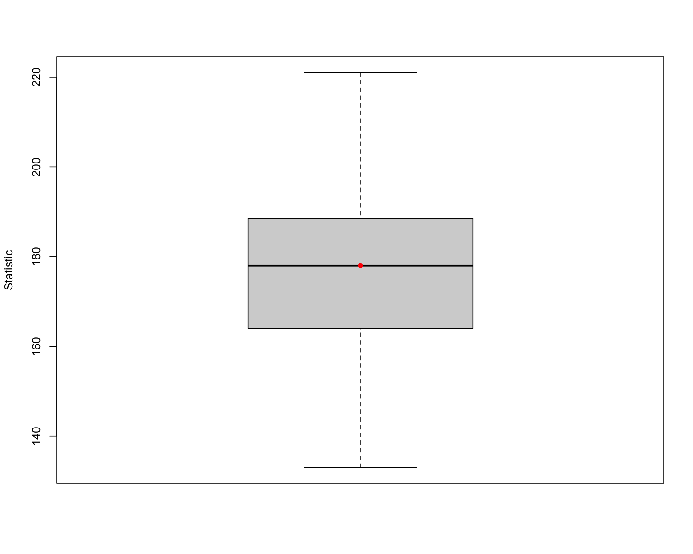

Doesn't seem to be an appreciably better fit than LOLOG without ordering

Would like to look at edge specified ordering process, 
i.e. consider neighbours in the ranking procedure since students sit in rank order
not supported by LOLOG currently.

### Save all the models for later


```r
# list making function
make_list <- function(networks, models, type, space = ls()) {
    models <- rep(models, each = length(networks))
    tmp <- unlist(mapply(networks, models, FUN = function(x, y) {
        return(paste(type, "_", x, "_", y, sep = ""))
    }, SIMPLIFY = FALSE))
    return(tmp)
}

fit_ergm_list <- make_list(c(1), seq(0, 4, 1), "ergm_fit")
ergm_list <- make_list(c(1), seq(0, 4, 1), "ergm")
summary_ergm_list <- make_list(c(1), seq(0, 4, 1), "summary_ergm")
gofit_ergm_list <- make_list(c(1), seq(0, 4, 1), "gofit_ergm")

fit_lolog_list <- make_list(c(1), seq(0, 23, 1), "lolog_fit")
lolog_list <- make_list(c(1), seq(0, 23, 1), "lolog")
summary_lolog_list <- make_list(c(1), seq(0, 23, 1), "summary_lolog")
gofit_lolog_list <- make_list(c(1), seq(0, 23, 1), "gofit_lolog")

# assign ergm variables for lists
for (i in ergm_list) {
    a <- eval(parse(text = paste("ergm_fit", substr(i, 5, nchar(i)), sep = "")))
    if (length(a) == 1 & is.na(a[1])) {
        assign(paste("ergm", substr(i, 5, nchar(i)), sep = ""), NA)
        assign(paste("summary_ergm", substr(i, 5, nchar(i)), sep = ""), NA)
        assign(paste("gofit_ergm", substr(i, 5, nchar(i)), sep = ""), NA)
    } else {
        assign(paste("ergm", substr(i, 5, nchar(i)), sep = ""), eval(parse(text = paste("ergm_fit",
            substr(i, 5, nchar(i)), "$model", sep = ""))))
        assign(paste("summary_ergm", substr(i, 5, nchar(i)), sep = ""), eval(parse(text = paste("ergm_fit",
            substr(i, 5, nchar(i)), "$summary", sep = ""))))
        assign(paste("gofit_ergm", substr(i, 5, nchar(i)), sep = ""), eval(parse(text = paste("ergm_fit",
            substr(i, 5, nchar(i)), "$gofit", sep = ""))))
    }
}

# assign lolog variables for lists
for (i in lolog_list) {
    a <- eval(parse(text = paste("lolog_fit", substr(i, 6, nchar(i)), sep = "")))
    if (length(a) == 1 & is.na(a[1])) {
        assign(paste("lolog", substr(i, 6, nchar(i)), sep = ""), NA)
        assign(paste("summary_lolog", substr(i, 6, nchar(i)), sep = ""), NA)
        assign(paste("gofit_lolog", substr(i, 6, nchar(i)), sep = ""), NA)
    } else {
        assign(paste("lolog", substr(i, 6, nchar(i)), sep = ""), eval(parse(text = paste("lolog_fit",
            substr(i, 6, nchar(i)), "$model", sep = ""))))
        assign(paste("summary_lolog", substr(i, 6, nchar(i)), sep = ""), eval(parse(text = paste("lolog_fit",
            substr(i, 6, nchar(i)), "$summary", sep = ""))))
        assign(paste("gofit_lolog", substr(i, 6, nchar(i)), sep = ""), eval(parse(text = paste("lolog_fit",
            substr(i, 6, nchar(i)), "$gofit", sep = ""))))
    }
}

# save lists:
save(list = c(ergm_list, summary_ergm_list, gofit_ergm_list), file = "ergm_fit.RData")
save(list = c(lolog_list, summary_lolog_list, gofit_lolog_list), file = "lolog_fit.RData")
```

### References 

For further readings and references you can check: 

  
  + Comparing the Real-World Performance of Exponential-family Random Graph Models and Latent Order Logistic Models (2021), Duncan A. Clark and Mark S. Handcock
  
  + ergm: Fit, Simulate and Diagnose Exponential-Family Models for Networks [ergm: statnet](https://github.com/statnet/ergm)
  
  + lolog: Latent Order Logistic (LOLOG) Graph Models [lolog: statnet](https://github.com/statnet/lolog)
  
  + statnet: Statistical software for the analysis, simulation and visualization of network data [statnet](https://github.com/statnet)
